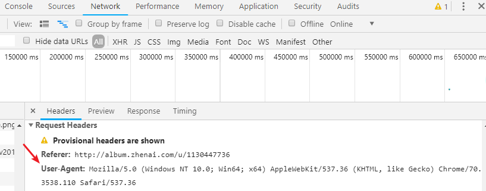

# GO语言爬虫项目笔记

**学习方法：**

> - 看第一遍视频，先不写代码，将思路写在笔记中，并且用截图工具将代码截下；
> - 根据上面的思路自己写代码，若有不会，看截图代码。


## 思路

### 1. 单任务版爬虫

#### 1.1 数据结构分析

##### - 每一个URL代表一个请求(request)，同时每个请求需要一个解析该请求的方法

​	所以将 request 定义为：

```go
type Request struct {
	Url       string
	ParseFunc func([]byte) ParseResult
}
```

##### - 每个请求被解析后，会得到请求结果（parseResult），其中包括我们需要的信息和子请求（request）

​	所以将 parseResult 定义为：

```go
type ParseResult struct {
	Requests []Request
	Items    []interface{}
}
```


#### 1.2 从URL中拉取网页信息的方法

​	当我们有了目标 URL 之后，就应该编写拉取该 URL 网页 body 的方法

```go
func Fetch(url string) ([]byte, error) {
	//	打印抓取的 URL
	log.Printf("New Fetching %s",url)
	/*resp, err := http.Get(url)
	if err != nil {
		panic(err)
	}
	defer resp.Body.Close()*/

	client := &http.Client{}
	req, err := http.NewRequest("GET", url, nil)
	if err != nil {
		log.Fatalln(err)
	}
	req.Header.Set("User-Agent", "Mozilla/5.0 (Windows NT 10.0; Win64; x64) AppleWebKit/537.36 (KHTML, like Gecko) Chrome/70.0.3538.110 Safari/537.36")

	resp, err := client.Do(req)
	if err != nil {
		log.Fatalln(err)
	}

	defer resp.Body.Close()


	if resp.StatusCode != http.StatusOK {
		err := fmt.Errorf("wrong status code: %d", resp.StatusCode)
		return nil, err
	}

	data, err := ioutil.ReadAll(resp.Body)
	if err != nil {
		return nil, err
	}
	return data, nil
}
```


#### 1.3 解析网页 body ，并从中提取我们需要的信息

​	获得了网页的body后，我们需要提取我们想要的信息，所以需要编写一个方法，专门做这个工作

```go
const cityListRe = `{linkContent:"([^"]+)",linkURL:"(http://m.zhenai.com/zhenghun/[0-9a-zA-Z]+)"}`

//	解析出城市列表，和对应的URL
func ParseCityList(content []byte) engine.ParseResult {
	compile := regexp.MustCompile(cityListRe)

	result := engine.ParseResult{}
	res := compile.FindAllSubmatch(content, -1)
	for _, m := range res {
		result.Items = append(result.Items, string(m[1]))
		result.Requests = append(result.Requests, engine.Request{
			Url:       string(m[2]),
			ParseFunc: engine.NilParse,
		})
	}
	return result
}
```


#### 1.4 所有方法的组织者，让整个程序运行起来的关键函数

​	该方法是所有程序的核心部件，他的职责是调度所有方法，使工作顺利完成；

```go
func Run(seeds ...Request) {
	//1、将所有的request整合到切片中
	//2、处理所有的request
	//	2.1 通过request抓取网页
	//	2.2 解析并获取目标内容
	//	2.3 获取的内容中，若还有request，则继续添加
	var requests []Request

	for _, r := range seeds {
		requests = append(requests, r)
	}

	for len(requests) > 0 {
		r := requests[0]
		requests = requests[1:]

		body,err:=fetcher.Fetch(r.Url)
		if err!=nil{
			log.Printf("Fetch error Url:%s  error:%v",r.Url,err)
			continue
		}

		result:=r.ParseFunc(body)

		requests = append(requests,result.Requests...)
		for _,item:=range result.Items{
			log.Printf("Get item %v",item)
		}
	}
}
```


#### 1.5 编写单元测试

- 为了避免其他的干扰因素，需要将网页body保存到本地
- 写预计会得到的三个结果，与测试出来的结果相比对，确定是否有错误


#### 1.6 城市解析器，解析子请求（request）的方法

- 和城市列表解析器相似，做相应修改就行


#### 1.7 用户解析器，解析“第三请求”（request）的方法

- 用户信息需要存储在结构体中，这种存储数据的模块通常都放在 model 文件夹中


- 解析用户的方法
  + 将爬取到的网页body传入到解析器方法中
  + 将正则表达式单独提取出来
  + 因为对每个属性解析的操作都一样，为了避免重复，编写一个方法专门做这件事
  + 将解析结果返回
- 使用到的且容易忘记的函数

```go
regexp.MustCompile()//	解析正则表达式
re.FindSubmatch()	//	查找匹配的内容	
```

### 2. 并发版爬虫

#### 2.1 简陋并发版爬虫

​	**所有的worker都在抢一个channel的东西，分发出去的go程不能回收，想做一些负载均衡也做不了，所以需要队列版并发**

1. **engine：**engine 是程序的起头，用来组织 scheduler 和 worker，worker 是在 engine 中启动的

   1. 为了防止 engine 和 scheduler 循环导包的问题，需要在 engine 中定义接口

      ```go
      type SimpleEngine struct {
      	WorkerAccount int
      	Scheduler Scheduler
      }
      type Scheduler interface {//	通过接口来调用 Scheduler 的方法，无需导包
      	Submit(Request)
      	MatchWorkerChan(chan Request)
      }
      ```

   2. 对接 worker 和 Scheduler 的 channel

      ```go
      func (s *SimpleEngine)Run(seeds ...Request) {
      	in := make(chan Request)//	in 是传入 worker 的 channel
      	s.Scheduler.MatchWorkerChan(in)
      ```

   3. 启动 worker Go程

      ```go
      out := make(chan ParseResult)
      for i := 0; i < s.WorkerAccount; i++ {
          go func() {
              Work(in,out)
          }()
      }
      ```

   4. 将request 传给 worker

      ```go
      for _, r := range seeds {
          s.Scheduler.Submit(r)
      }
      ```

   5. 接受worker 输出的结果，并分类处理

      ```go
      for{
          result:= <-out//	循环读取
          for _,item:=range result.Items{
              log.Printf("Get item %v",item)
          }
          for _,request:=range result.Requests{
              sch.Submit(request)//	子请求同样传给 scheduler
          }
      }
      ```

2. **worker：**单任务版中，fetch 和 parseRequest 耗时较多，所以将这一模块写入 go程 中，并发执行，我们把这一模块称为 ：worker （输入的是 request ，输出的是 parseResult，parseResult中包含 item 和 request）；

   1. 所有的 go程 之间的通信都是使用 channel 进行，worker 需要和两个 go程 ：engine，scheduler 进行通信，就需要使用 channel ：in (接收 Request)  & out (输出 ParseResult)
   2. worker 将 item 和 request 发送给 engine 后，engine 将 item 进行数据处理，将 request 发送给 调度器。

   ```go
   //	worker 函数
   func Worker(in chan Request,out chan ParseResult) {
       for{
        	request:= <-in	//循环读取 channel in 中的内容
   		body, err := fetcher.Fetch(request.Url)
   		if err != nil {
   			log.Printf("Fetch error Url:%s  error:%v", request.Url, err)
   			return
   		}
   		result := request.ParseFunc(body)//	解析生成parseResult
   		out<- result   //	将result送出
       }
   }
   ```

3. **scheduler：**单任务版中的 request 是从切片中提取出来传参数给 woeker 的，当我们组建了多个 worker 并发工作时，我们就需要一个对象——调度器(scheduler)；他的工作内容是：**给 worker 分发request** 。

   1. 并发程序中，所有的 go程 之间的通信都是使用 channel 进行，所以这里 scheduler 需要将 request 分发给 worker，就需要通过 channel 分发；

   2. scheduler 与 worker 通信，必须将两者的 channel 对接，本质上是一个 channel 。

      ```go
      type Scheduler struct {
      	WorkerChan chan engine.Request //	Scheduler 的channel
      }
      //	与 worker 对接的方法
      func (s *Scheduler) MatchWorkerChan(c chan engine.Request) {
      	s.WorkerChan = c
      }
      //	将 request 传给 worker 的方法
      func (s *Scheduler) Submit(r engine.Request) {
      	s.WorkerChan<- r
      }
      ```

4. 

   1. 


#### 2.2 队列并发版爬虫


#### engine

1. 待 scheduler 和 worker 都准备好后，engine 将 request 全部扔给 Scheduler 
2. engine 创建 worker ，创建数量自己定
3. 接收 每个worker 的工作结果，打印获取的 item ，将子 request 扔给 Scheduler

#### Scheduler

1. scheduler 负责将request 传给 worker ，通过使用它们的共同通道 in
2. scheduler 的 Submit 方法作用是：将request 传给worker

#### worker

1. worker 是将 request 转为 parseRequest 的工作单元
2. worker 的通信是通过两个channel完成的，in -> 接收request ，out -> 传出 parseRequest
3. worker 每调用一次，就会启动一个 go程 
4. 每个 go程 调用 work 方法，返回 parseResult 


无缓冲channel 需要双方都准备好，如果两个 goroutine 没有同时准备好，通道会导致先执行发送或接收操作的 goroutine 阻塞等待    


### 去重

使用map[string]bool去重，URL为key


## 分布式

#### 特征

1. 多节点
2. 消息传递
3. 完成特定需求

#### 多节点

1. 容错性
2. 可扩展性
   - 可以通过增加节点提高性能
3. 固有分布性
   - 有些业务原本就有分布性，比如全国都有的业务。

#### 消息传递

1. 节点具有私有存储
2. 易于开发
   - 对外的接口不变，里边可以随意操作
3. 可扩展性
   - 可以新增节点，放两天试一试

##### 消息传递方法

1. REST 基于HTTP
   - method（动词）
   - IP/Port
   - Path （资源路径 名词）
2. RPC
   - 远端将需要传输的数据序列化，传输，对端再反序列化
3. 中间件
   消息队列……
4. 


#### 为什么使用分布式？

- 单个节点会限流
  - **解决方案：**将worker分组，由不同节点启动，中间由网络连接
- 去重会消耗大量时间，使用多个节点来同时做
  - **解决方案：**启动单独去重服务，使用Redis，由worker来调用
- 数据存储问题，固有分布式问题


#### 分布式架构

1. worker服务 
2. 存储服务
3. 去重服务


## 遇到的困难

- 正则表达式写成了手机版的地址
- 爬取网页的时候，服务器拒绝请求，报错：403

```go
//	解决方案：伪装成浏览器请求
client := &http.Client{}
req, err := http.NewRequest("GET", url, nil)
if err != nil {
    log.Fatalln(err)
}
//	第二个参数是浏览器的header信息，看下图
req.Header.Set("User-Agent", "Mozilla/5.0 (Windows NT 10.0; Win64; x64) AppleWebKit/537.36 (KHTML, like Gecko) Chrome/70.0.3538.110 Safari/537.36")

resp, err := client.Do(req)
if err != nil {
    log.Fatalln(err)
}

defer resp.Body.Close()

```




- 因为scheduler 和 engine 都在 主Go程 中，导致无缓冲 channel 出现阻塞等待，导致程序无法继续执行
- 


