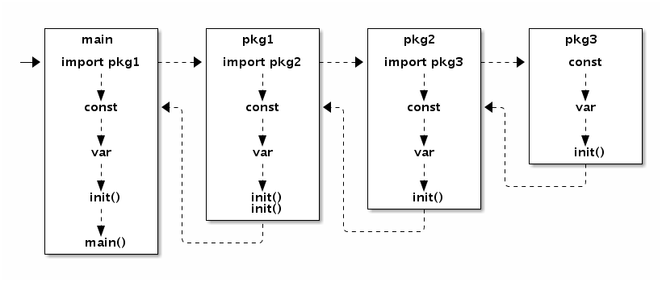

# GO学习笔记

## GO工具

### govendor包依赖管理工具

使用 govendor 进行项目依赖管理，该工具将 项目依赖的外部包拷贝到项目中的vendor目录下，并通过 vendor.json 文件来记录依赖包的版本,方便用户使用相对稳定的依赖。<font color=red>编译的时候，系统优先从vendor目录中寻找依赖包，如果vendor中没有，然后再去GOPATH中寻找</font>。

#### 命令集合

|  指令  |                          含义                          |
| :----: | :----------------------------------------------------: |
|  init  |       创建 `vendor` 文件夹和 `vendor.json` 文件        |
|  list  |                  列出已经存在的依赖包                  |
|  add   |     从 `$GOPATH` 中添加依赖包，会加到 vendor.json      |
| update |                从 `$GOPATH` 升级依赖包                 |
| remove |               从 `vendor` 文件夹删除依赖               |
| status |        列出本地丢失的、过期的和修改的`package`         |
| fetch  |      从远端库添加或者更新 `vendor` 文件中的依赖包      |
|  sync  | 本地存在`vendor.json` 时候拉取依赖包，匹配所记录的版本 |
|  get   |                     等同于`go get`                     |


#### vendor中依赖包的类型

对于 govendor 来说,依赖包主要有以下多种类型:

| 状态      | 缩写状态 | 含义                                           |
| --------- | -------- | ---------------------------------------------- |
| +local    | l        | 本地包,及项目自身的包组织                      |
| +external | e        | 外部包,即被 $GOPATH 管理,但不在 vendor 目录下  |
| +vendor   | v        | 已被 govendor 管理,即在vendor目录下            |
| +std      | s        | 标准库中的包                                   |
| +unused   | u        | 未使用的包,即包在vendor目录下,但项目并没有使用 |
| +missing  | m        | 代码引用了依赖包,但该报并没有找到              |
| +program  | p        | 主程序包,意味着可以编译为执行文件              |
| +outside  |          | 外部包和缺失的包                               |
| +all      |          | 所有的包                                       |

#### 简单的使用

- 安装，该命令会将govendor可执行文件下载到 $GOPATH 的 bin 目录下

  ```shell
  $ go get github.com/kardianos/govendor
  ```

  命令行执行`govendor`	,查看安装结果.

  > **注意**: 需要把 `$GOPATH/bin/`加到`PATH`中

- 使用如下：

  ```shell
  # 进到 GOPATH 中的一个项目中
  cd "my project in GOPATH"
  
  # 初始化 vendor 目录, project 下出现 vendor 目录
  govendor init
  
  # 将该项目依赖的GOPATH中的包，添加到vendor中
  govendor add +external
  
  # 查看vendor中的包依赖情况
  govendor list
  
  # 查看vendor中某一特定包的依赖情况
  govendor list -v fmt
  
  # 从远程获取 golang.org/x/net/context 包 指定的版本或修订
  govendor fetch golang.org/x/net/context@a4bbce9fcae005b22ae5443f6af064d80a6f5a55
  govendor fetch golang.org/x/net/context@v1   
  
  # 获取标签和分支名为 v1 的context包
  govendor fetch golang.org/x/net/context@=v1  
  
  # 更新一个包到最新
  govendor fetch golang.org/x/net/context
  
  # 格式化本地依赖库库
  govendor fmt +local
  
  # Build everything in your repository only
  govendor install +local
  
  # Test your repository only
  govendor test +local
  ```


### gofmt工具的使用

```shell
gofmt 文件名 		# - 输出格式化后的代码

gofmt -w 文件名 	# - 重新格式化代码并更新文件

gofmt -r'rule' 文件名 	# - 格式化代码前执行指定的规则

gofmt 包所在的路径 	# - 格式化整个包下的源文件
```


### 设置自动代理

[GCTT | 【干货】go get 自动代理](https://mp.weixin.qq.com/s/N1tixHZuG6MLiWTd4vIQrQ)


## 字符串处理

```go
//	1. 字符串按 指定分割符拆分：	Split
ret := strings.Split(str, " I")

//	2. 字符串按 空格拆分： Fields
ret = strings.Fields(str)

//	3. 判断字符串结束标记 HasSuffix
flg := strings.HasSuffix("test.abc", ".mp3")

//	4. 判断字符串起始标记 HasPrefix
flg := strings.HasPrefix("test.abc", "tes.")
```

## 文件操作

### Openfile的使用

```go
//	路径，选项（os.O_RDWR），操作模式(FileMode 如：ModeDir 目录操作)
f, err := os.OpenFile("C:/itcast/testFile.xyz", os.O_RDWR, 6)
```


### 在指定的位置写入

```go
//	Seek(偏移量，起始偏移位置)，返回 相对开头的偏移量 和 错误信息
//	偏移量：+ 表示从头开始向左；- 表示从尾开始向右。
//	起始偏移位置：0,1,2分别是开头位置，当前位置和末尾位置，也可使用io.SeekStart，io.SeekCurrent 和 io.SeekEnd
off, _ := f.Seek(-5, io.SeekEnd)
fmt.Println("off:", off)

//	WriteAt()在指定位置写入数据，返回写入数据长度和错误信息
n, _ = f.WriteAt([]byte("1111"), off)
fmt.Println("WriteAt n :", n)
```


### 按行读取

使用 bufio 包

```go
// 创建一个带有缓冲区(用户缓冲)的 reader
reader := bufio.NewReader(f)
for {
    buf, err := reader.ReadBytes('\n')		// 读一行数据，遇到\n，将读取到的数据返回到切片中
    if err != nil && err == io.EOF {
        fmt.Println("文件读取完毕")
        return
    } else if err != nil {
        fmt.Println("ReadBytes err:", err)
    }
    fmt.Print(string(buf))
}
```


### 目录的读取

目录也是文件

>  Readdir() 返回一个接口切片，每个接口代表目录中的一个成员，接口中有该成员的一切信息

```go
// 打开目录
f, err := os.OpenFile(path, os.O_RDONLY, os.ModeDir)
if err != nil {
    fmt.Println("OpenFile err: ", err)
    return
}
defer f.Close()
// 读取目录项
info, err:= f.Readdir(-1)	// -1： 读取目录中所有目录项
if err != nil {
    fmt.Println("Readdir err: ", err)
    return
}
// 变量返回的切片
for _, fileInfo := range info {
    if fileInfo.IsDir() {			// 是目录
        fmt.Println(fileInfo.Name(), " 是一个目录")
    } else {
        fmt.Println(fileInfo.Name(), " 是一个文件")
    }
}
```


## orm操作

### orm需求分析
##### 痛点：
​	当你开发一个应用程序的时候(不使用O/R Mapping),你可能会写不少数据访问层的代码，用来从数据库保存，删除，读取对象信息，等等。你在DAL中写了很多的方法来读取对象数据，改变状态对象等等任务。**而这些代码写起来总是重复的**。 
##### 解决方案：
1. 提高了开发效率。由于ORM可以自动对 对象与数据库 中的Table进行字段与属性的映射，所以我们实际已经不需要一个专用的、庞大的数据访问层。 
2. ORM提供了对数据库的映射，不用sql直接编码，能够像操作对象一样从数据库获取数据。


### orm原理

##### 定义：

> **对象关系映射**（英语：**Object Relational Mapping**，简称**ORM**，或**O/RM**，或**O/R mapping**），是一种[程序设计](https://zh.wikipedia.org/wiki/%E7%A8%8B%E5%BC%8F%E8%A8%AD%E8%A8%88)技术，用于实现[面向对象](https://zh.wikipedia.org/wiki/%E7%89%A9%E4%BB%B6%E5%B0%8E%E5%90%91)编程语言里不同[类型系统](https://zh.wikipedia.org/wiki/%E9%A1%9E%E5%9E%8B%E7%B3%BB%E7%B5%B1)的数据之间的转换。从效果上说，它其实是创建了一个可在编程语言里使用的“虚拟[对象数据库](https://zh.wikipedia.org/wiki/%E7%89%A9%E4%BB%B6%E8%B3%87%E6%96%99%E5%BA%AB)”。

##### orm如何运作？

> - 每个类对应数据库中的一张表，每个对象对应数据库表的一行，对象的每个属性对应表中的字段。orm是一个处于对象和数据库中的中间层，这个中间层提供了对象与数据库的映射。
> - 你用O/R Mapping保存，删除，读取对象，O/R Mapping负责生成[SQL](http://www.itisedu.com/phrase/200604022014515.html) ，你只需要关心对象就好。


### orm对象包含的函数


### orm使用步骤

#### 1.对数据库的前期操作

##### 导包：

> - orm 属于中间层，底层操作数据库还需要导入数据库驱动，我们这里导入MySQL数据库驱动
> - 。。。。。。


##### 与数据库关联：

###### **？？为什么要注册一个别名为‘default’的数据库？	TODO**

```go
//	初次建立时，必须注册一个别名为‘default’的数据库；数据库驱动名；连接数据库的命令：“用户名：密码@tcp(IP:port)/数据库名称?编码格式”
orm.RegisterDataBase("default","mysql","root:123456@tcp(127.0.0.1:3306)/class1?charset=utf8")
```

##### 时区设置：

###### **是否应该设置本地时间 或者 系统时间？如何设置本地时间？	TODO**

​	存取默认都为 UTC 时间，

```go
// 设置为 UTC 时间
orm.DefaultTimeLoc = time.UTC
```


##### 在内存中注册表格模型：

​	映射规则：

> - 第一个字母如果是大写，变为小写
> - 后边每遇到大写字母，变为'_小写'

```go
package main

import "github.com/astaxie/beego/orm"

type User struct {
    Id   int
    Name string
}
//	结构体是一个类，对应数据库中的一张表
func init(){
    orm.RegisterModel(new(User))
}
//	也可以同时注册多个 model
orm.RegisterModel(new(User), new(Profile), new(Post))
```


##### 创建表格：

​	**这一步才是真正将表格创建出来**

###### 没有orm.RunSyncdb这步，数据库中有没有表格？	没有

```go
// 数据库别名；更改数据前是否将表格清零；是否显示表格信息
orm.RunSyncdb("default", false, true)
```


#### 2.增删改查操作

```go
//	new一个orm对象
o := orm.NewOrm()
user := User{Name: "slene"}
// insert 增
id, err := o.Insert(&user)
// update 改
user.Name = "astaxie"
num, err := o.Update(&user)
// read one 查
u := User{Id: user.Id}
err = o.Read(&u)
// delete 删
num, err = o.Delete(&u)
```

- 查询表格

  ```go
  o := orm.NewOrm()
  //	获得名为 area 的表的查询对象
  qp := o.QueryTable("area")
  areaList := []models.Area{}
  //	将表 area 中的数据全部放在切片 areaList 中
  num, err := qp.All(&areaList)
  ```

- 


## go语言的底层基础

### 基础数据类型源码位置

> runtime 包里 和 buildin包里

### go语言中的error

#### 源码：

```go
// 路径：buildin/buildin.go
type error interface {
	Error() string
}
```

- 通过源码可以看出，error本质上是一个带方法的 interface；
- 带方法的interface，底层存储了两个字段：实现该interface的变量的原始类型 和 该变量的值；
- 只有上述两个字段都为 nil 的时候，判断 interface == nil 才为 true。

#### 可能会踩的坑

使用自定义的 错误类型 的时候，例码：

```go
// 这里定义了一个能够实现 error 的结构体，自定义的错误类型
type MyError struct {
	s string
}
func (e *MyError) Error() string {
	return e.s
}
func test() error {
	// 这里声明了该错误类型的变量，并且赋值为nil
	var a *MyError
	a = nil
	// 这里return的时候，a被自动转成 error类型，里面存储的类型不为nil
	return a
}
func main() {
    // 这里的err是一个接口，存储的类型为 MyError，值为空，所以这里返回的err永远都不为 nil
	err := test()
	fmt.Println(err == nil)
}
```

上述代码引用的是 errors.New() 方法的源代码：

```go
func New(text string) error {
	return &errorString{text}
}

type errorString struct {
	s string
}

func (e *errorString) Error() string {
	return e.s
}
```


### String

字符串是 不可变 值类型，内部⽤用指针指向 UTF-8编码格式的 字节数组。

- 默认值是空字符串 ""。
- 可以用索引号访问某字节，如 s[i]。
- 不能⽤用取地址符获取字节元素指针，&s[i] 非法。 
- 不可变类型，无法修改字节数组。
- 字节数组尾部不包含 NULL。


### struct


### Map


### recorver

recover 使用的三个要点：

1. recover 必须在 defer 中调用；
2. recover 必须在函数中调用，匿名不匿名都行；
3. recover 不能在多层函数中调用。

具体使用案例：

```go
//	1: 没有在defer中使用
func main() {
    if r := recover(); r != nil {
    	log.Fatal(r)
    }
    panic(123)
    if r := recover(); r != nil {
    	log.Fatal(r)
    }
}
//	2: 不可以在defer的多层函数中调用
func main() {
    defer func() {
        if r := MyRecover(); r != nil {
            fmt.Println(r)
        }
    }()
    panic(1)
}
func MyRecover() interface{} {
    log.Println("trace...")
    return recover()
}
//	3: 不可再defer的多层函数中调用
func main() {
    defer func() {
        defer func() {
            if r := recover(); r != nil {
            	fmt.Println(r)
        	}
    	}()
	}()
	panic(1)
}
//	4: 正确
func MyRecover() interface{} {
	return recover()
}
func main() {
    defer MyRecover()
    panic(1)
}
//	5: 必须要在defer的函数中调用
func main() {
    defer recover()
    panic(1)
}
//	6: 正确
func main() {
    defer func() {
        if r := recover(); r != nil { ... }
    }()
    panic(nil)
}
```


### goroutine

#### goroutine的最佳实现

**来源链接：**[GCTT 出品 | Go 语言中的同步队列](https://mp.weixin.qq.com/s/HoslXrqteioDzpjzWb8UvQ)

**思想：**不要通过共享内存来通讯，而要通过通讯来共享内存。

```go
func tester(q *queue.Queue) {
   for {
       test()
       q.StartT()
       fmt.Println("Tester starts")
       pingPong()
       fmt.Println("Tester ends")
       q.EndT()
  }
}
func programmer(q *queue.Queue) {
   for {
       code()
       q.StartP()
       fmt.Println("Programmer starts")
       pingPong()
       fmt.Println("Programmer ends")
       q.EndP()
  }
}
func main() {
   q := queue.New()
   for i := 0; i < 10; i++ {
       go programmer(q)
  }
   for i := 0; i < 5; i++ {
       go tester(q)
  }
   select {}
}

// 用goroutine的方式实现queue
package queue
const (
   msgPStart = iota
   msgTStart
   msgPEnd
   msgTEnd
)
type Queue struct {
   waitP, waitT   int
   playP, playT   bool
   queueP, queueT chan int
   msg            chan int
}
func New() *Queue {
   q := Queue{
       msg:    make(chan int),
       queueP: make(chan int),
       queueT: make(chan int),
  }
   go func() {
       for {
           select {
           case n := <-q.msg:
               switch n {
               case msgPStart:
                   q.waitP++
               case msgPEnd:
                   q.playP = false
               case msgTStart:
                   q.waitT++
               case msgTEnd:
                   q.playT = false
              }
               if q.waitP > 0 && q.waitT > 0 && !q.playP && !q.playT {
                   q.playP = true
                   q.playT = true
                   q.waitT--
                   q.waitP--
                   q.queueP <- 1
                   q.queueT <- 1
              }
          }
      }
  }()
   return &q
}
func (q *Queue) StartT() {
   q.msg <- msgTStart
   <-q.queueT
}
func (q *Queue) EndT() {
   q.msg <- msgTEnd
}
func (q *Queue) StartP() {
   q.msg <- msgPStart
   <-q.queueP
}
func (q *Queue) EndP() {
   q.msg <- msgPEnd
}

// 用互斥锁的方式实现 queue
package queue

import "sync"

type Queue struct {
   mut                   sync.Mutex
   numP, numT            int
   queueP, queueT, doneP chan int
}

func New() *Queue {
   q := Queue{
       queueP: make(chan int),
       queueT: make(chan int),
       doneP:  make(chan int),
  }
   return &q
}

func (q *Queue) StartT() {
   q.mut.Lock()
   if q.numP > 0 {
       q.numP -= 1
       q.queueP <- 1
  } else {
       q.numT += 1
       q.mut.Unlock()
       <-q.queueT
  }
}

func (q *Queue) EndT() {
   <-q.doneP
   q.mut.Unlock()
}

func (q *Queue) StartP() {
   q.mut.Lock()
   if q.numT > 0 {
       q.numT -= 1
       q.queueT <- 1
  } else {
       q.numP += 1
       q.mut.Unlock()
       <-q.queueP
  }
}

func (q *Queue) EndP() {
   q.doneP <- 1
}
```


### channel

#### channel的引出

当多个协程操作同一内存地址时，会产生资源竞争而发生错误。于是就设计出用来协程之间通信的channel。channel背后也是用了锁的机制。

#### 无缓冲chan中包含的GO并发内存模型

1. 发送数据前接收必须准备好，如果没有准备好会出现死锁； 
2. 接收完成之前发送必须已经结束，保证接收的数据完整； 

<font color=red>上述两点是并发模型的重要保证</font>

#### 导致死锁的情况

1. chan 关闭后，往该 chan 发送数据会导致 runtime panic； 
2. channel的读和写可以不同步（异步），但是如果只写不读，会死锁；

#### 使用小技巧

2. **判断chan是否关闭：**从该 chan 接收数据会立刻返回，同时可以加入第二个参数，判断是关闭了还是正常数据返回，即：`x, ok :=<-c` ，这时候 ok 是 false，因为此特性，close 一个 chan 可以用于广播（广播通道关闭的信号）； 
2. 往一个 nil chan 发送数据会永远阻塞


### Interface使用的细节

- 接口被指针类型变量实现 且 方法绑定在指针类型上，接口实例化后的对象和指针类型变量是同一个实例


#### 判断对象是否实现了某接口

例码：

```go
type MyWriter struct{}
func (m *MyWriter) Write(p []byte) (n int, err error) {
	return 0, nil
}
// 声明一个匿名变量
var _ io.Writer = (*MyWriter)(nil)
```

**解释：**

1. 检查 *MyWriter 是否实现了 io.Writer 接口
2. (*MyWriter)(nil) 是将nil强转为 *MyWriter 类型
3. 若*MyWriter没有实现 io.Writer 接口，编译器会直接报错


### Slice源码分析


### 反射


### 类型

Go 中的类型可以分为命名类型（named type） 和未命名类型（unnamed type）。

#### 命名类型

命名类型包括 bool、int、string 等

#### 未命名类型

 array、slice、map 等和 **具体元素类型**、**长度** 等有关，属于未命名类型。

**注意：**具有 相同声明的未命名类型 被视为同一类型。如：

- 具有相同基类型的指针。
- 具有相同元素类型和⻓度的 array。
- 具有相同元素类型的 slice。
- ……

#### 常见坑

```go
package main
import (
    "fmt"
)
func main() {
    type MyMap1 map[string]string
    type MyMap2 map[string]string
    var myMap = map[string]string{"name": "polaris"}
    var myMap1 MyMap1 = myMap
    // 此处会报错
    var myMap2 MyMap2 = myMap1
    fmt.Println(myMap2)
}
```

1. `type MyMap map[string]string`  规定了元素的类型必须是string，不能再更改，所以就属于命名类型；
2. 既然属于命名类型，那么第二题中的 `MyMap1  MyMap2`就是两个不同类型，不能够相互赋值；
3. 命名类型 和 非命名类型 相互赋值，只要基础类型一样就可以。


### 函数

- 绑定在值类型的方法 和 指针类型的方法是不同的

  - 绑定在指针类型变量的方法，当变量无法取地址时，不能调用；**注意：**临时值不能够取地址

  ```go
  type duration int
  
  func (d *duration) pretty() string {
  	return fmt.Sprintf("Duration: %d", *d)
  }
  
  func main() {
      // duration(42)无法取地址，所以不可以调用pretty的方法
  	duration(42).pretty()
  }
  ```


#### 函数的各种使用场景

##### 最普通的包级别函数

```go
package lib

func Sum(a, b int) int {
    return a + b
}
```

##### 在函数内定义函数

```go
package main

func main() {
    // 注意定义方式，不能 func sum(a, b int) int {} 这种形式
    sum := func(a, b int) int {
        return a + b
    }
}
```

这种形式，一般用于函数内部重复代码的抽取，而这些逻辑在其他函数不会用到，没必要提升为包级别函数。可以在标准库源码中搜索：`:= func` 查到相关使用示例。

##### 匿名函数

```go
// 保留两个 b 之间（包括 b）的字符串
strings.TrimFunc("abcfbd", func(r rune) bool {
    if r != 'b' {
        return true
    }
    return false
})
```

匿名函数常用于回调函数，函数返回值是函数的场景。比如 HTTP 中间件经常见到类似这样的代码：

```go
return func(resp http.ResponseWriter, req *http.Request) {
    // TODO:
}
```

匿名函数另外常见的场景是用于 go 语句和用于 defer 语句。

##### 定义函数类型

函数作为参数和返回值，一般来说，为了增强可读性（可能还有其他考虑），在这两种场景下，我们经常会定义函数类型，典型的是 net/http 包的 HandleFunc 类型：

```go
type HandlerFunc func(ResponseWriter, *Request)
```

然后让 HandlerFunc 实现 Handler 接口，也就是实现 `ServeHTTP(ResponseWriter, *Request)` 方法，它的实现只需要简单的调用自己即可：

```go
func (f HandlerFunc) ServeHTTP(w ResponseWriter, r *Request) {
    f(w, r)
}
```

这样，任何符合 HandlerFunc 类型的函数，都可以通过强制类型转换为 HandlerFunc，进而满足 Handler 接口，**这是一个很好地技巧**。

##### 函数表达式

```go
myPrintln := fmt.Println
myPrintln("Hello World!")
```

**注意: **下列一些内置的函数不能当做表达式使用：

```go
append cap complex imag len make new real unsafe.Alignof unsafe.Offsetof unsafe.Sizeof
```

##### 函数作为 数组、slice、map 或 chan 的元素

**注意**：根据 map 对 key 的要求，函数不能用作 map 的 key。

这下面种场景下，为了可读性，一般也会定义函数类型。如：

```go
func main() {
    type myfunc func()

    m := make(map[string]myfunc)
    m["abc"] = func(){
        fmt.Println("abc")
    }

    for _, f := range m {
        f()
    }
}
```


### 可寻址

1. 直接值（临时值）不能取地址；
   如：&true、&"abc"、&math.Int() 等都是非法；

2. 字符串字节元素不能取地址；
   如：

   ```go
   s: = "Hello World"
   _ = &(s[5])
   ```

3. map 元素不能取地址；
   如：

   ```go
   m := map[int]int{99:1}
   _ = &(m[99])
   ```

4. 编译器只会自动对 **变量** 取地址，而不会自动对 直接值 取地址；
   如：

   ```go
   type T struct{}
   func (t *T) f() {}
   func main() {
       t := T{}
       (&t).f() // ok ，和下一句等价 
       t.f()  // ok ，将自动取地址
   
       (&T{}).f() // ok
       // T{}.f() // error
       // 不会自动取地址
   }
   ```

   那么为什么经常见到 `&T{}` 这种写法？`&T{}` 是为了编程方便，添加的一个语法糖 ，是下面形式的缩写，而不是临时值不能取地址的一个例外。

   ```go
   temp := T{}
   &temp
   ```

5. new(T) 相当于取T的地址，等价于&T{}。


### 闭包

```go
func Closure() func() int {
    var x int
    return func() int {
        x++
        return x
    }
}
```

调用这个函数会返回一个函数变量。`i := Closure()`：通过把这个函数变量赋值给 `i`，`i` 就成为了一个**闭包**。

**注意：** `i` 保存着对 `x` 的引用，可以理解 `i` 中有着一个指针指向 x 或 **i 中有 x 的地址**。由于 `i` 有着指向 `x` 的指针，所以可以修改 `x`。


## go的并发

### 并发和并行：

1. 并发：多个线程在一个CPU中运行，来回切换，微观上看，同一时刻只执行一个线程；
2. 并行：多个线程在多个CPU中运行，同时执行多个线程。

### Go语言中的主线程和协程

1. 主线程其实是进程的另一种说法；
2. 协程是Go语言设计者在线程上优化得来的，比线程更轻巧（独立栈空间，共享堆空间）。


### MPG模式

1. M : 相当于主线程；P：是协程运行的环境；G：在P中运行的协程
2. 多个M可运行在多个CPU上，叫做并行，运行在同一CPU上，叫做并发
3. M主线程和M1协程并发执行
4. 在单CPU的情况下，go的并发是非抢占的，后边的协程要执行，首先要有协程出现阻塞，延迟或者放弃执行

##### 查看多线程竞争关系命令：

```go
go build -race main.go	//	然后再执行main.exe
```


### 如何控制并发执行的 Goroutine 的最大数目？

例码：

```go
// work包管理一个 goroutine 池来完成工作
package work

import "sync"

// Worker 必须满足接口类型，
// 才能使用工作池
type Worker interface {
    Task()
}

// Pool提供一个goroutine池，这个池可以完成
// 任何已提交的Worker任务
type Pool struct {
    work chan Worker
    wg   sync.WaitGroup
}

// New创建一个新工作池
func New(maxGoroutines int) *Pool {
    p := Pool{
        work: make(chan Worker),
    }

    p.wg.Add(maxGoroutines)
    for i := 0; i < maxGoroutines; i++ {
        go func() {
            for w := range p.work {
                w.Task()
            }
            p.wg.Done()
        }()
    }
    p.wg.Wait()

    return &p
}

// Run提交工作到工作池
func (p *Pool) Run(w Worker) {
    p.work <- w
}

// Shutdown等待所有goroutine停止工作
func (p *Pool) Shutdown() {
    close(p.work)
    p.wg.Wait()
}
```


## go程序中的规范

### 变量名声明规范

在 Go 编程中最好用短的变量名，尤其是那些作用域比较有限的局部变量

> 用 `c` 而不是 `lineCount`
>
> 用 `i` 而不是 `sliceIndex`

1. 基本规则：距离声明的地方越远，变量名需要越具可读性。

2. 作为一个函数接收者，1、2 个字母的变量比较高效。

3. 像循环指示变量和输入流变量，用一个单字母就可以。

4. 越不常用的变量和公共变量，需要用更具说明性的名字。


### `_` 标识符的常用场景：

1. 在多重赋值场景中，忽略某些值，常见于 `if`、`for` 等语句中，如：`if _, err := os.Stat(path); os.IsNotExist(err)`；

2. 没有使用的 import 或变量，常用于调试；

3. import 包只使用包的副作用，常见的是导入 mysql 等数据驱动；

4. 接口类型检查，常见的有：

   - 类型断言 ： `if _, ok := val.(json.Marshaler); ok`；

   - 判断类型是否实现某个接口 ： `var _ json.Marshaler = (*RawMessage)(nil)`；

     > `var _ json.Marshaler = &RawMessage{}` 也可以判断，但是这个需要分配内存空间，上面的写法不用。


### “逗号 ok/error”  模式

Go 支持多返回值，因此经常见到 `, ok` 或 `, error` 这种模式。在一个需要赋值的 if 条件语句中，使用这种模式去检测第二个参数值会让代码显得优雅简洁。这种模式在  Go 语言编码规范中非常重要。我们梳理下都有哪些情况下会使用该模式。

1. 在函数返回时检测错误；
2. 检测 map 中是否存在一个键值；
3. 检测一个接口类型变量 varI 是否包含了类型 T，即类型断言；
4. 检测一个通道 ch 是否关闭；`if input, closed := <-ch; closed { ... }`


## 导包

### 点导包

测试的时候使用，用来将测试代码伪装成包内文件

### Go 包初始化流程：



### go语言的执行顺序的规则

A语句依赖B语句，A虽然在B的前边，执行顺序依然是先B再A；以语句为单位。

下面看一个初始化的例子，例码：

```go
var a, b, c = f() + v(), g(), sqr(u()) + v()

func f() int { return c }
func g() int  { return a }
func sqr(x int) int { return x*x }
func u() int { return 1}
func v() int { return 2}
```

**分析：**

1. 首先执行的是给a赋值的语句，但是f() 依赖于c ，所以必须先执行 c 赋值语句；
2. 执行`sqr(u()) + v()`的时候依赖 u()，所以这里最先执行的是 u()；
3. 按照这种规则，推出函数的执行顺序是：u()、sqr()、v()、f()、v()、g()。


## go的架构经验

### 设计新类型

在声明一个新类型之后，声明一个该类型的方法之前，需要先回答以下几个问题：

- 这个类型的本质是什么？
- 如果给这个类型增加或者删除某个值，是要创建一个新值，还是要更改当前的值？
  - 如果是要创建一个新值，那么该类型的方法就使用值接收者；
  - 如果是要修改当前值，那么就使用指针接收者。

这几个问题答案会影响整个程序内部传递这个类型的值的方式：是按值做传递，还是按指针做传递。保持传递的一致性很重要。

这个背后的原则是，不要只关注某个方法是如何处理这个值，而是要关注这个值的本质是什么。

大家仔细看看标准库的两个例子：time.Time   类型和 os.File 类型。

**结论：**

- 是使用值接收者还是指针接收者，不应该由该方法是否修改了接收到的值来决定。这个决策应该基于该类型的本质；

#### 思考

为什么Time 类型很多方法都是值类型接收者？

**解答：**因为某一刻的时间对象应该是唯一，不应该被改变，所以使用值类型接收者。


## 官方库解析

### context包的使用

#### context包的作用

> 主要用于控制goroutine，防止goroutine泄漏


#### func Background() Context 和 func TODO() Context

- 这是context包内部已经实现好了的两个空 context 对象；
- 可以通过调用小标题中的两个方法获得该 context 对象；
- 这两个函数获得的 context ，一般用来作为根，往下派生；


#### 四个派生函数

##### func WithCancel(parent Context) (ctx Context, cancel CancelFunc)

- WithCancel() 函数只是单纯的生成一个parent的一个副本，相当于拷贝；


##### func WithDeadline(parent Context, deadline time.Time) (Context, CancelFunc)

- WithDeadline() 函数生成一个时间期限必须在 parent 之前的 context；
- 若时间期限在 parent 之后，则返回 parent 的副本；


##### func WithTimeout(parent Context, timeout time.Duration) (Context, CancelFunc)

- WithTimeout() 函数是对 WithDeadline() 的一层封装，timeout不再是期限时间点，而是代表“经过多长时间”


##### func WithValue(parent Context, key, val interface{}) Context

- 源码：

  ```go
  func WithValue(parent Context, key, val interface{}) Context {
      if key == nil {
          panic("nil key")
      }
      if !reflect.TypeOf(key).Comparable() {
          panic("key is not comparable")
      }
      return &valueCtx{parent, key, val}
  }
  ```

- 官方应用案例：

  ```go
  type favContextKey string
  
  f := func(ctx context.Context, k favContextKey) {
      if v := ctx.Value(k); v != nil {
          fmt.Println("found value:", v)
          return
      }
      fmt.Println("key not found:", k)
  }
  
  k := favContextKey("language")
  ctx := context.WithValue(context.Background(), k, "Go")
  
  f(ctx, k)
  f(ctx, favContextKey("color"))
  ```

- Output:

  ```go
  found value: Go
  key not found: color
  ```

  暂时还看不出来这个函数有什么特殊作用...


##### Context 对象

- 源码：

  ```go
  type Context interface {
      // Done returns a channel that is closed when this Context is canceled
      // or times out.
      Done() <-chan struct{}
  
      // Err indicates why this context was canceled, after the Done channel
      // is closed.
      Err() error
  
      // Deadline returns the time when this Context will be canceled, if any.
      Deadline() (deadline time.Time, ok bool)
  
      // Value returns the value associated with key or nil if none.
      Value(key interface{}) interface{}
  }
  ```

- Done()，返回一个单向输出channel。当times out或者调用cancel方法时，将会close掉。

- Err()，返回一个错误。表明(indicate)该context为什么被取消掉。

- Deadline()，当goroutine快要被cancel的时候，返回截止时间。

- Value()，返回值。