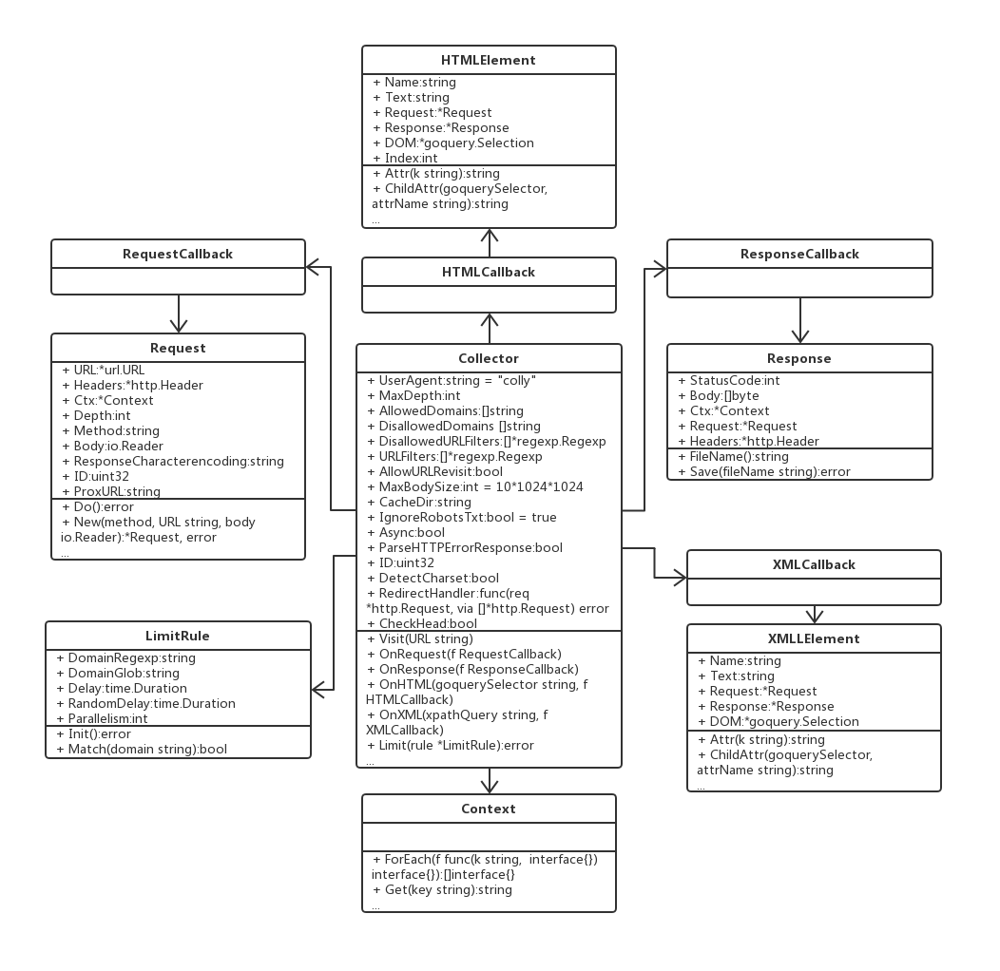
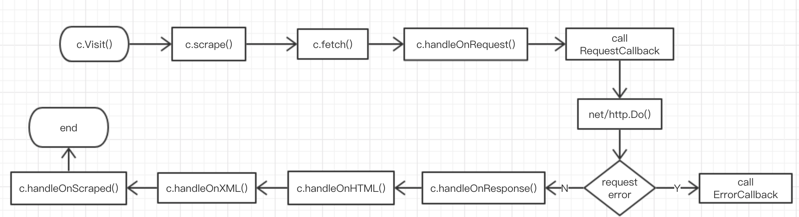

# 爬虫准备知识 Colly 学习之二：Colly 的设计

[上一节](https://studygolang.com/topics/8724)，我们了解了 Colly，并学习了一个简单的示例，Colly 的使用，大体上分为三大块：

- 实例化一个 Collector
- 注册各个回调函数
- 调用 `Visit()` 方法启动爬取工作

虽然是简单的三大块，但其中的一些设计思想值得我们学习借鉴。本节，我们就一起来学习 Colly 的设计。

## 梳理 Colly 的类图

为了方便梳理，我们采用面向对象中的 UML 图来描述，把 Go 中的 struct 用类图来表示。



从上面的类图中可以看出，Colly 库的核心是围绕着 Collector 类型进行设计的。

## Collector 类型设计的启发

Collector 类型的设计，至少有 4 点值得学习：

1. 独特的实例化函数（工厂函数）
2. 回调机制的使用
3. Debug 的设计
4. 可扩展性

## 独特的实例化函数

```go
func NewCollector(options ...func(*Collector)) *Collector
```

实例化一个类型，一般有以下几种方式：

1. new(T)
2. T{} 或 &T{}
3. 自定义的工厂函数

对于类型中的成员，我们可以在实例化时传递，如第 2、3 种方式；也可以在生成实例后，通过 `t.Field` 的形式赋值（前提是导出的成员）。

一般地，我们在定义工厂函数时，要为类型成员初始化，会给工厂函数定义相应的参数。而 Collector 类型的工厂函数参数，却是一个或多个函数。这样设计有以下方面的原因：

1. Collector 类型的成员较多；
2. 成员的类型多样；
3. 不要求所有的成员必须指定值；

针对这些问题，Collector 工厂类 NewCollector() 巧妙的使用不定参数，而且类型是 `func(*Collector)`，这样可以有选择的配置一个或多个选项，很好地解决了上面的三个问题。它的源码如下：

```go
func NewCollector(options ...func(*Collector)) *Collector {
    c := &Collector{}
    c.Init()

    for _, f := range options {
        f(c)
    }

    c.parseSettingsFromEnv()

    return c
}
```

同时，通过函数的方式来配置选项，就好比很多面向对象语言中的 Set 方法，可以在里面有其他的一些逻辑判断，而不仅仅是设置一个值。比如以下配置函数：

```go
func Debugger(d debug.Debugger) func(*Collector)
```

## 回调机制的使用

了解 JS 或其他客户端编程的同学，应该对回调或事件机制很熟悉：当某件事情发生时候，执行一个回调。

Colly 的设计，使用了回调机制。它将抓取网页的执行过程看做一个生命周期，在这个生命周期内相应的事件发生时执行回调，它们的执行顺序如下：

1. OnRequest：在请求发送前回调
2. OnError：在请求过程中发生错误时回调
3. OnResponse：响应接收后回调
4. OnHTML：在 OnResponse 之后，如果接收到的内容是 HTML 格式则回调
5. OnXML：在 OnHTML 之后，如果接收到的内容是 HTML 或 XML 格式则回调
6. OnScraped：抓取完成回调，在 OnXML 之后。

这样，我们只需要在相应的注册回调函数中加上我们的业务逻辑即可。

我大概画了一个回调机制的状态图（处理流程），是 Colly 内部的实现逻辑：



### 启发

以后我们设计系统时，可以在一些关键流程节点，通过回调机制提供扩展行为，也是钩子的一种实现方式。

## Debug 的设计

在项目中，特别是开发阶段，我们会不断需要进行 Debug，通常，我们可以借助 fmt 或 log 来进行调试（像 delve/gdb 这样的调试工具也是一种方式，不过对于并发程序，日志可能是更常用、更好用的调试方式。delve/gdb 对于分析程序，进行底层学习还是很有用的）。

然而，有时候 fmt 或 log 的方式，不能很好的满足需求，这时可以设计一个专门的 Debug 类型，用于进行调试。Colly 就这么做了。

在 Colly 中，启用调试，跟配置其他选项类似，可以通过给工厂函数添加一个函数参数：`colly.Debugger()`， `Debugger()` 函数接收一个 `debug.Debugger` 接口类型。

```go
type Debugger interface {
    // Init initializes the backend
    Init() error
    // Event receives a new collector event.
    Event(e *Event)
}
```

也就是说，我们可以定义自己的 `Debugger`。当然，Colly 自己实现了两个 Debugger：LogDebugger 和 WebDebugger，我们可以直接使用。

在 Colly 的各个事件（钩子）中加上了 Debugger 相关的代码（判断 Collector 的 debugger 变量是否为 nil 来实现的），只需要启用 Debug，便会在这些事件触发时输出日志，方便进行调试。

顺便提一句，一般 Web 项目，日志会分 Level，一般 Debug 会是其中的一个 Level。也就是说，Web 项目通常通过日志 Level 的形式来进行调试。

## 可扩展性

Colly 扩展性的设计包括两个部分：

1. 内置的插件形式，如 github.com/gocolly/colly/extensions 包中的几个函数；
2. 存储后端，用于存储 Cookie 和访问过的 url，需要实现 github.com/gocolly/colly/storage 包中的 Storage 接口；

### 插件（扩展）形式

我们先来看内置的插件形式。这里我们一起来看看 extensions.Referer 函数的实现。

```go
func Referer(c *colly.Collector) {
    c.OnResponse(func(r *colly.Response) {
        r.Ctx.Put("_referer", r.Request.URL.String())
    })
    c.OnRequest(func(r *colly.Request) {
        if ref := r.Ctx.Get("_referer"); ref != "" {
            r.Headers.Set("Referer", ref)
        }
    })
}
```

所谓的插件或扩展，无非是预定义注册前面讲解的关键事件回调函数。事件模式（钩子）让整个库扩展性有了很大的提升。

### 后台存储

接下来看看 storage.Storage 接口和存储实现。

```go
// Storage is an interface which handles Collector's internal data,
// like visited urls and cookies.
// The default Storage of the Collector is the InMemoryStorage.
// Collector's storage can be changed by calling Collector.SetStorage()
// function.
type Storage interface {
    // Init initializes the storage
    Init() error
    // Visited receives and stores a request ID that is visited by the Collector
    Visited(requestID uint64) error
    // IsVisited returns true if the request was visited before IsVisited
    // is called
    IsVisited(requestID uint64) (bool, error)
    // Cookies retrieves stored cookies for a given host
    Cookies(u *url.URL) string
    // SetCookies stores cookies for a given host
    SetCookies(u *url.URL, cookies string)
}
```

我们通过学习 Colly 默认的内存存储 InMemoryStorage，来尝试实现自己一个文件存储：FileStorage。

#### InMemoryStorage 的实现

通过 Storage 接口的 5 个方法，我们可以知道，具体的实现需要存储访问过的 URL 和 Cookie，可以很容易的想到，访问过的 URL（由 requestID 代表）使用一个 map 来存储，而 Cookie 应该是标准库 net/http 的 CookieJar 实现，同时为了避免竞争条件，需要一个 sync.RWMutex。（因为 CookieJar 的实现要求必须是并发安全的，所以，这里的 sync.RWMutex 只是用于保护 requestID）

```go
type InMemoryStorage struct {
    visitedURLs map[uint64]bool
    lock        *sync.RWMutex
    jar         *cookiejar.Jar
}
```

这里的结构体定义，jar 用于保存 Cookie，直接使用了 net/http/cookiejar 包的 Jar 类型，它是 http.CookieJar 的内存实现。

Storage 接口的 Init 方法用于初始化数据结构。

其他的方法不一一进行讲解，这里着重讲一下 Cookie 的设置和获取方法。

- 设置 Cookie 的方法

```go
// SetCookies implements Storage.SetCookies()
func (s *InMemoryStorage) SetCookies(u *url.URL, cookies string) {
    s.jar.SetCookies(u, UnstringifyCookies(cookies))
}
```

直接调用 jar 的 SetCookies 方法，关键在于根据 cookies 字符串反序列化为 `[]*http.Cookie`。

```go
// UnstringifyCookies deserializes a cookie string to http.Cookies
func UnstringifyCookies(s string) []*http.Cookie {
    h := http.Header{}
    for _, c := range strings.Split(s, "\n") {
        h.Add("Set-Cookie", c)
    }
    r := http.Response{Header: h}
    return r.Cookies()
}
```

该方法通过设置 http.Header 和 http.Response，由 Response 的 Cookies 方法获得 `[]*http.Cookie`。

- 获取 Cookie 的方法

```go
// Cookies implements Storage.Cookies()
func (s *InMemoryStorage) Cookies(u *url.URL) string {
    return StringifyCookies(s.jar.Cookies(u))
}
```

直接调用 jar 的 Cookies 方法，关键在于根据 `[]*http.Cookie` 序列化为字符串。

```go
// StringifyCookies serializes list of http.Cookies to string
func StringifyCookies(cookies []*http.Cookie) string {
    // Stringify cookies.
    cs := make([]string, len(cookies))
    for i, c := range cookies {
        cs[i] = c.String()
    }
    return strings.Join(cs, "\n")
}
```

#### 实现自己的 storage.Storage：FileStorage

我先不给出 FileStorage 的实现，留给大家做练习。实现完后，通过 collector.SetStorage() 来覆盖默认的 InMemoryStorage。

## 小结

我们来总结下该文的关键点：

1. 通过梳理类图来学习一个库；
2. 通过事件（钩子）回调机制来设计一个长流程处理，方便扩展和用户使用；
3. 设计必要的 Debugger；
4. 通过设计接口考虑可扩展性；