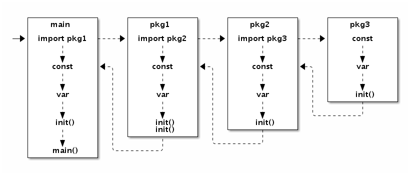

# 每周汇总 2019-03-24

## 每日一学

### 问题01：

```go
chan int
chan <- int
<- chan int
```

以上三者有什么区别？下面两种用于什么场景？它们之间能相互赋值吗？


**讨论结果：**

1.  `chan int`可读可写(双向),  `chan <- int`只写(单向) ,  `<- chan int`只读(单向)；
2. 双向chan可以转成单向chan，单向chan不能够转成双向chan；
3. 应用场景 ……


### 问题02：

Go语言中的错误是一种接口类型。接口信息中包含了原始类型和原始的值。只有当接口的类型和原始的值都为空的时候，接口的值才对应nil。其实当接口中类型为空的时候，原始值必然也是空的；反之，当接口对应的原始值为空的时候，接口对应的原始类型并不一定为空的。

```go
func myFunc() error {
    var p *MyError = nil
    if fail() {
        p = ErrFail
    }
    return p
}
```

以上代码有什么问题？


**讨论结果：**

1. 这里即使 fail() 为false ，返回的error也!=nil；
2. 这段代码执行的结果：return  p 不是nil ，因为指针p有类型。如果调用这个函数调用方判断 if err == nil ，这个逻辑不会被执行。


### 问题03：

Go 语言规范中定义了求值顺序。（描述改进）

1、一般地，在计算表达式、赋值或返回语句的操作数时，所有函数调用、方法调用、通讯操作（\<-）等在词法层面按照从左到右的顺序求值。注意以下代码中的注释。

```go
func test07()  {
	a := 1
	f := func() int { a++; return a }
	x := []int{a, f()}            // x may be [1, 2] or [2, 2]: evaluation order between a and f() is not specified
	m := map[int]int{a: 1, a: 2}  // m may be {2: 1} or {2: 2}: evaluation order between the two map assignments is not specified
	n := map[int]int{a: f()}      // n may be {2: 3} or {3: 3}: evaluation order between the key and the value is not specified
	fmt.Println("x:",x)
	for key, value := range m {
		fmt.Printf("m[%d]:%d\r\n",key,value)
	}
	fmt.Println("n:",n)
}
func main() {
	test07()
}
```

以上代码的总结是：求值表达式中
​	1）变量和函数的先后顺序未定义；
​	2）map 元素的先后顺序未定义；
​	3）map 中 key 和 value 的先后顺序未定义；

2、然而，在包级别，初始化依赖决定了变量声明中表达式的求值顺序。只要是顺序未定义的，在实际项目中一定要避免使用，否则可能出现莫名其妙的“bug”，被“坑”~


**讨论结果：**

1. Go语言规范说，map 中的元素是无序的，在早起版本，循环多次遍历 map，发现顺序永远是一样的。Go 为了避免大家认为 map 元素是有序的，在后来版本中，故意无序输出。也就是说，规范中定义的不确定性，可能目前的实现用了某种确定的方案，但很有可能将来换一种方案，因此程序不能依赖，否则某天可能出现问题了。

2. 在下面三行代码中，{}里的语句执行顺序是不可控的，不一定是按照从左到右的顺序执行，所以在实际项目中尽量不要依赖“从左到右的执行顺序”。


   ```go
   x := []int{a, f()}          
   m := map[int]int{a: 1, a: 2} 
   n := map[int]int{a: f()} 
   ```


### 问题04：

关于 chan 的几个小知识点：

1. chan 关闭后，往该 chan 发送数据会导致 runtime panic；
2. 从该 chan 接收数据会立刻返回，同时可以加入第二个参数，判断是关闭了还是正常数据返回，即：x, ok := <-c ，这时候 ok 是 false，因为此特性，close 一个 chan 可以用于广播（广播通道关闭的信号）；
3. 往一个 nil chan 发送数据会永远阻塞；
4. 无缓存 chan 的 发送操作完成 发生在 接收操作开始之后；同样的，无缓存的 chan 上的发送操作总在对应的接收操作完成前发生；这也是 Go 的并发内存模型之一；
5. [同学总结channel](<http://note.youdao.com/noteshare?id=d3455700fcadbe9bec41fdc5b923616f&sub=7D578C78777D4EF98972B750DC2A79F1>)，参考来源 在文章里有说明。


**讨论结果：**

1. 主要针对第 4 点进行的讨论（第 4 点的用处是啥？）：

   - 是并发模型的重要保证；

   - 主要是两点：一是，发送数据前接收必须准备好，如果没有准备好会出现死锁；二是，接收完成之前必须发送已经结束，保证接收的数据完整；
   - 用在go程同步。


## 知识点学习

### 知识点干货：

1. 使用数组和切片时，len 函数返回的是 int 类型，如果没有其他限制，理论上最大长度不能超过 int，否则溢出。所以，32 位机器上，最长不能超过 1<<31 - 1，64 位机器就是 1<<63 - 1。当然，一般场景不会用到这么大数组。
2. 空结构体不占“空间”，所以，经常会有：chan struct{} 这种定义。
3. Go 包初始化流程：
   
4. recover 必须放在 defer 中才有效，否则永远返回 nil。


## 常见坑

### 问题01：

如下代码输出什么：  应该如何改进？

```go
func main() {
    for i := 0; i < 3; i++ {
    	defer func(){ println(i) } ()
    }
}
```


**讨论结果：**

1. 输出：3 3 3 ；

2. `defer func(){ println(i) } ()` 应改为：`defer func(i int){ println(i) } (i)`；

3. 原理： i 的内存地址一直是一样的，在匿名函数三次打印之前，已经被for循环赋值为3，所以输出 3 3 3；

4. 类似坑：

   ```go
   func main(){
       for i:=0;i<10;i++{
           go func(){
               fmt.println{i}
           }()
       }
   }
   
   //  正确应为：
   func main(){
       for i:=0;i<10;i++{
           go func(i int){
               fmt.println{i}
           }(i)
       }
   }
   ```


### 问题02：

可变参数是空接口类型
当参数的可变参数是空接口类型时，传入空接口的切片时需要注意参数展开的问题。例如：

```go
func main() {
    var a = []interface{}{1, 2, 3}
    fmt.Println(a)
    fmt.Println(a...)
}
```

不管是否展开，编译器都无法发现错误，但是输出是不同的。实际中可能会出现“莫名”的情况。


**讨论结果：**

1. 展开相当于 println(1,2,3)，传入了三个interface，每个interface只装了一个int变量，不展开相当于println([1,2,3])，传入了一个[]int参数；
2. a...是a中的三个元素1, 2, 3分别传入。


## 面试题

### 问题01：

以下代码是否有问题？为什么？

```go
package main

var a string
var done bool

func setup() {
    a = "hello, world"
    done = true
}
func main() {
    go setup()
    for !done {
    }
    print(a)
}
```


**讨论结果：**

1. 以上代码能够打印出 “hello world”
2. go的并发是非抢占的，其他协程想运行，首先要有协程放弃运行；
3. 当指定CPU数量为 1 时(main函数的第一行加上`runtime.GOMAXPROCS(1)`)，会一直for循环下去，否则done的值依然会被 go程 改变；


### 问题02：

如何控制并发执行的 Goroutine 的最大数目？


**讨论结果：**

1. demo01：

   ```go
   package main
   
   import (
       "fmt"
       "time"
   )
   
   var ch chan int
   
   func test(i int) {
       fmt.Println(i)
       time.Sleep(1 * 1e9)
       <-ch
   }
   
   func main() {
       ch = make(chan int, 10)
       for i:=0; i<1000; i++ {
           ch<-i
           go test(i)
       }
   }
   ```

2. demo02:

   ```go
   type pool struct { 
       maxNum int // 最大Goroutine 数目
       taskChan chan *Task // 接收并传递任务的通道
   }
   func (pool)work(){
       for range taskChan {
           Task() // 这里执行任务
       }
   }
   func (pool)run(){
       for i:=0;i<pool.maxNum;i++{
           go pool.work()  // 这里只启动maxNum个go程
       }
   }
   ```


### **问题03：**

recover 知识点
以下哪些能正常捕获异常，哪些不能？

```go
//	1:
func main() {
    if r := recover(); r != nil {
    	log.Fatal(r)
    }
    panic(123)
    if r := recover(); r != nil {
    	log.Fatal(r)
    }
}
//	2:
func main() {
    defer func() {
        if r := MyRecover(); r != nil {
            fmt.Println(r)
        }
    }()
    panic(1)
}
func MyRecover() interface{} {
    log.Println("trace...")
    return recover()
}
//	3:
func main() {
    defer func() {
        defer func() {
            if r := recover(); r != nil {
            	fmt.Println(r)
        	}
    	}()
	}()
	panic(1)
}
//	4:
func MyRecover() interface{} {
	return recover()
}
func main() {
    defer MyRecover()
    panic(1)
}
//	5:
func main() {
    defer recover()
    panic(1)
}
//	6:
func main() {
    defer func() {
        if r := recover(); r != nil { ... }
    }()
    panic(nil)
}
```


**讨论结果：**

1. recover 必须在 defer 函数中运行；
2. recover 必须在defer函数中直接调用才有效，也就是不能多层函数（当然，并不要求函数是匿名还是非匿名。
    所以，那道题的答案是 4、6。不过 6 中，panic 的参数，一般不应该用 nil，但不影响 recover 的使用；
3. **汇总：** defer，函数，直接在函数中调用，不能有多层调用。


### 问题04：

请使用 Go 实现一个函数得到两数相加结果，可用以下两种调用方式： 
​	sum(2,3) 输出5
​	sum(2)(3) 输出5
​	sum(2)(3)(4)  输出9
请写出你的代码。	


**讨论结果：**

1. demo01(函数调用末尾带())：
   	sum(2,3)() 输出5
      	sum(2)(3)() 输出5
      	sum(2)(3)(4)()  输出9

   ```go
   package main
   
   type f func(...int) f
   
   func fsum(i ...int) f {
   	var sum int
   	var fun f
   	fun = func(a ...int) f {
   		for _, v := range a {
   			sum += v
   		}
   		if len(a)<=0 {
   			fmt.Println(sum)
   			return nil
   		}
   		return fun
   	}
   
   	for _, value := range i {
   		sum+=value
   	}
   	if len(i)>1{
   		fmt.Println(sum)
   	}
   	return fun
   }
   func main() {
   	fsum(2)(3)(4)()
       fsum(2,3)()
   	fsum(2)(3)()
   }
   ```

2. 球主答案：

   ```go
   package main
   
   import (
   	"fmt"
   	"strconv"
   )
   
   var total int
   
   // 定义一个函数类型，函数的返回值是该函数类型。这个技巧可以学习一下，挺牛逼的。
   // 类似的，定义结构体的时候，结构体成员可以是该结构体的指针类型。
   type SumFunc func(...int) SumFunc
   
   // SumFunc 函数类型实现 fmt.Stringer 接口。
   // 这里使用这个技巧挺取巧，挺棒的。
   // 根据题目的要求，一个函数似乎一会返回一个 int 类型，一会返回一个函数类型
   // 这是做不到的。所以，这里的实现，永远只返回函数类型，
   // 然后借助 fmt.Print 和 fmt.Stringer 接口来做到似乎间接返回了 int 类型
   func (s SumFunc) String() string {
   	tmpTotal := total
   	total = 0
   	return strconv.Itoa(tmpTotal)
   }
   
   func main() {
   	
   	// 这里声明和赋值分开，保证了 sum 可以在函数体中使用。
   	var sum SumFunc
   
   	sum = func(nums ...int) SumFunc {
   		for _, num := range nums {
   			total += num
   		}
   		
   		return sum
   	}
   
   	fmt.Println(sum(2, 3))
   	fmt.Println(sum(2)(3))
   	fmt.Println(sum(2)(3)(4))
   	fmt.Println(sum(2)(3)(4, 5))
   }
   ```

   点击运行验证：[The Go Playground](https://play.studygolang.com/p/WaT7ifCOSd4)


### 问题05：

请指出以下函数的调用顺序:

```go
var a, b, c = f() + v(), g(), sqr(u()) + v()

func f() int { return c }
func g() int  { return a }
func sqr(x int) int { return x*x }
func u() int { return 1}
func v() int { return 2}
```


**讨论结果：**

1. 在包级别，初始化依赖决定了变量声明中表达式的求值顺序。
   - 以上代码是和 init() 函数一个级别的，是在初始化的时候执行的；
   - A依赖B，那么执行顺序就是先B再A；
2. `var a, b, c = f() + v(), g(), sqr(u()) + v()`  这里看起来应该先给 a 赋值，也就是要调用 f() 和 v() 这两个函数，但是 f 函数依赖了 c，所以需要先初始化 c，也就是调用 sqr(u())+v()，这一个表达式又应该先调用 u()，然后是 sqr()，接着是 v()，这样 c 初始化完了，所以，f() 可以调用了（v 会再调用一次），最后才是 g() 来初始化 b。
3. 所以最后的顺序是：u()、sqr()、v()、f()、v()、g()。
4. 可以点击这个运行看看：[The Go Playground](https://play.studygolang.com/p/utt-pBQzXZd)


### 问题06：

有如下代码：

```go
type MyWriter struct{}
func (m *MyWriter) Write(p []byte) (n int, err error) {
	return 0, nil
}
var _ io.Writer = (*MyWriter)(nil)
```

请问，`var _ io.Writer = (*MyWriter)(nil) `有什么用？


**讨论结果：**

1. 检查 *MyWriter 是否实现了 io.Writer 接口
2. (*MyWriter)(nil) 是将nil强转为 *MyWriter 类型


## 同学问的问题

### 问题01：

​	去除大数据文件的重复行

**解决思路：**

1. 求出每行数据的hash，存入map的key中；每得到一行数据的hash，利用map判断该key是否有值；有则过滤，无则添加到map中。


## 每周链接

- **实用工具：**  [GCTT | 【干货】go get 自动代理](https://mp.weixin.qq.com/s/N1tixHZuG6MLiWTd4vIQrQ)

- 分享一个比较好的网站：
  - 官网 [LeetCode - The World's Leading Online Programming ...](https://leetcode.com/)
  - 中文网 [力扣 (LeetCode) 中国官网 - 全球极客挚爱的技术成长平台](https://leetcode-cn.com/)
- [在Golang的HTTP请求中共享数据](https://mp.weixin.qq.com/s/kXUGJpWrUMA0W7ptZB4HSA)
- [Go 闭包 ](https://articles.zsxq.com/id_2j5geai2s8wd.html)

- 有兴趣的小伙伴可以一起研讨交流交流 ：[深入理解 Go map：赋值和扩容迁移 - 煎鱼的清汤锅 - SegmentFault 思否](https://segmentfault.com/a/1190000018632347)

