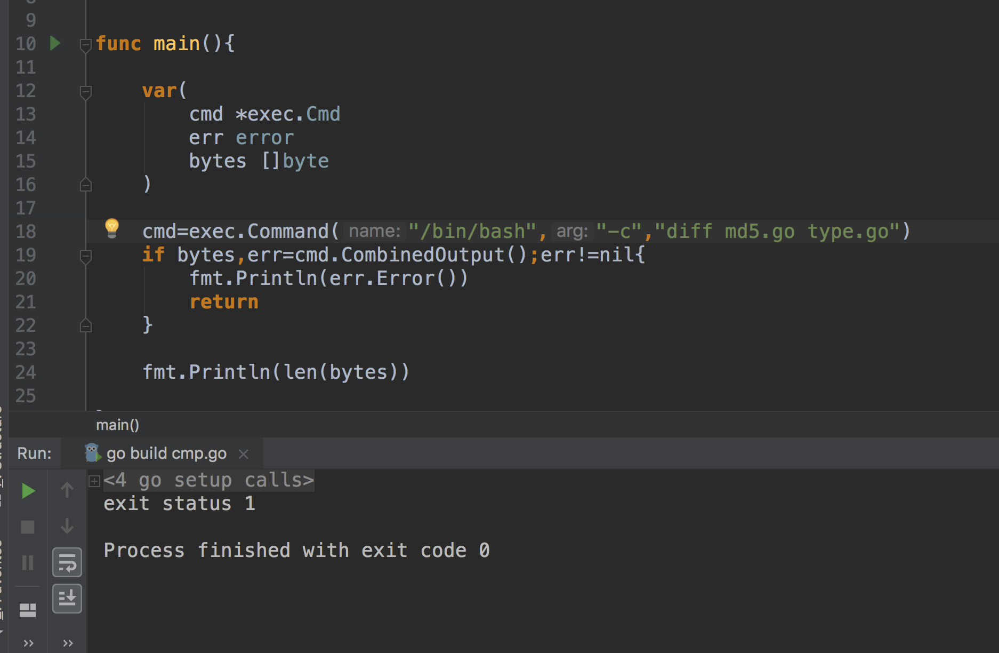

# 一周汇总  2019-04-14

## 每日一学

### 问题一：

在声明一个新类型之后，声明一个该类型的方法之前，需要先回答以下几个问题：

- 这个类型的本质是什么？
- 如果给这个类型增加或者删除某个值，是要创建一个新值，还是要更改当前的值？
  - 如果是要创建一个新值，那么该类型的方法就使用值接收者；
  - 如果是要修改当前值，那么就使用指针接收者。

这几个问题答案会影响整个程序内部传递这个类型的值的方式：是按值做传递，还是按指针做传递。保持传递的一致性很重要。

这个背后的原则是，不要只关注某个方法是如何处理这个值，而是要关注这个值的本质是什么。

大家仔细看看标准库的两个例子：time.Time   类型和 os.File 类型。

**结论：**

- 是使用值接收者还是指针接收者，不应该由该方法是否修改了接收到的值来决定。这个决策应该基于该类型的本质；
- 这条规则的一个例外是：需要让类型值符合某个接口的时候，即便类型的本质是非原始本质的，也可以选择使用值接收者声明方法。这样做完全符合接口值调用方法的机制。

大家想想为什么Time 类型很多方法都是值类型接收者？

#### **讨论结果：**

1.  某一刻的时间对象应该是唯一，不应该被改变，所以使用值类型接收者。

#### tag

方法接收者


### 问题二：

关于字符串
字符串是不可变值类型，内部⽤用指针指向 UTF-8 字节数组。

- 默认值是空字符串 ""。
- ⽤用索引号访问某字节，如 s[i]。
- 不能⽤用序号获取字节元素指针，&s[i] ⾮非法。 
- 不可变类型，⽆无法修改字节数组。
- 字节数组尾部不包含 NULL。


## 知识点学习

### 问题一：

面试题：
[面试题：如何控制并发执行的 Goroutine 的最大数目？很赞的一个答案  - Go语言中文网 -...](https://studygolang.com/topics/8771)
知识星球对代码显示太不友好，所以发布在Go中文网，后续长文都会发布在 Go中文网付费专栏，需要登录才能访问，如果你无法访问，请联系我提供Go中文网用户名。


### 问题二：


## 常见坑

#### 问题一：


**讨论结果：**

1. 


## 面试题

### **问题一：**

以下代码是否有问题？

```go
type duration int

func (d *duration) pretty() string {
	return fmt.Sprintf("Duration: %d", *d)
}

func main() {
	duration(42).pretty()
}
```


**讨论结果：**

1. duration(42) 无法取址，不能调用 prerry() 方法；

2. 应该改为

   ```go
   var a duration(42)
   a.pretty()
   ```

   或者修改prerry()方法为值类型接收

   ```go
   func (d duration) pretty() string {
   	return fmt.Sprintf("Duration: %d", d)
   }
   ```

   

#### tag

方法接收者


### 问题二：

开发测试中，我们有时候会需要配置本地 host，那么，在 Go 语言中，如何实现类似配置 host 的功能。
例如，[Example Domain](http://example.com/) ，如何不修改本地 hosts 文件的情况下，写 Go 程序能访问该域名。


**讨论结果：**

1. 代码实现域名解析的功能，可以用一个map存储域名和ip的映射关系


### 问题三：

以下代码输出什么？

```go
data, i := [4]int{0, 1, 2, 3}, 0
i, data[i] = 1, 10
fmt.Println(i, data)
```

**讨论结果：**

- 输出： 1 [10 1 2 3]
- 在执行第二行代码时，首先会先获取 i 的值，在执行赋值操作


### 问题四：

直播中提到的，为什么 TCP 连接叫 3 次握手，而断开却叫 4 次挥手？

**讨论结果：**

- 握手没有状态判断，默认是未连接的，挥手的时候要判断双方是否真的断开了
- 因为tcp协议是面向连接的、可靠的通信协议，要保证数据对方都能收到，所以在断开时交互都要确认，防止数据丢失。
  - 难道连接的时候不用不用相互确认？
  - 三次握手就能确定对方和自己收发正常了，而且建立连接的时候不携带数据，没必要第四次了。


### 问题五：

在浏览器中输入：[https://baidu.com](https://baidu.com/) 到页面显示出来，你能描述下中间都经历了什么，涉及到什么技术，越详细越好。

**讨论结果：**

- 首先在浏览器缓存查找baidu.com的IP地址（如果有的话），再在系统缓存查找IP地址→路由器dns缓存→isp的dns缓存→isp的dns服务器从根服务器递归搜索（一般不用查这么长）。查到IP地址后，浏览器作为客户端添加443端口后发起tcp连接（三次握手），向百度服务器发起一条HTTP get请求，中间可能经历很多代理，百度服务器收到请求后，没有问题的话就返回一条响应，客户端读取HTTP响应报文渲染在屏幕上，最后浏览器关闭连接
- 客户端-dns服务器（返回ip）
  客户端（发送请求包数据）-服务端
  服务端（发送响应包数据）-客户端
  涉及技术：http协议


### 问题六：

Nginx 是一个反向代理服务器。为什么是反向代理？那什么是正向代理


**讨论结果：**

- 我理解的反向代理是指，从客户端的角度去访问服务端，因为服务端有可能是多个服务器多个地址所以需要一个服务器做代理，让客户端可以始终看到一个服务器，代理服务器做一些负载均衡的事。正向代理就是代理客户端，和服务器直接通信的是代理服务器
- nginx有流量转发的功能，比如网站并发量很大时候，可以通过设置upstream将流量分配到不同的服务器上，或者服务器端内有一些应用服务器因为安全考虑并不想直接对外暴露给外部访问，通过配proxy_pass来重定向访问地址，用户并不知道这些，用户只需要知道它要访问的网址就行了。
  正向代理和反向代理的一个区别是用户是否需要自己配置代理服务器地址。比如说要访问谷歌，用户需要自己配置代理进行访问，这个是正向代理。但是访问百度就不需要了，访问百度的时候用户只需要知道baidu.com，百度服务器内部流量调度负载均衡这些用户统统不感知，这个是反向代理。


## 同学问的问题

### 问题一：

请问：database/sql 进行 query 查询对 rows 迭代，在没有defer rows.close情况下，正常迭代完成会自动调用close释放连接，我想知道在迭代没有完成时强制break退出循环是否会一直占用该连接，多次调用之后数据库连接池会不会没有新的可用连接

**球主回答：**

1. 按理应该是会耗尽连接。可以是实验下。文档中没说明，长时间不知道会不会自动超时回收，这个得看具体实现。我抽时间实验下，同时尝试看下源码


### 问题二：

各位大佬，求助，我用Go调用diff 怎么总是失败，调用其他的命令，例如 ls, echo 都可以成功，diff ,cmp,sdiff 都无法成功。Google半天看了Dash里的文档无果。




**球主回答：**

- 多半不在环境变量 path 中。你试试用绝对路径调用 diff


## 今日链接

- [GCTT 出品 |我们必须遵循的 12 个 Go 语言最佳实践](https://mp.weixin.qq.com/s/2uHqw9C02hoLWa-Mmg9RLw) 	tag: go语言设计模式
- go轻松学：[GoQuickLearn/README.md at master · jemygraw/GoQuic...](https://github.com/jemygraw/GoQuickLearn/blob/master/README.md)

- [GCTT 出品 | Go 语言中的同步队列](https://mp.weixin.qq.com/s/HoslXrqteioDzpjzWb8UvQ)

- 今天星球直播内容的整理_[服务端漫游  - Go语言中文网 - Golang中文社区](https://studygolang.com/articles/19728)

  

