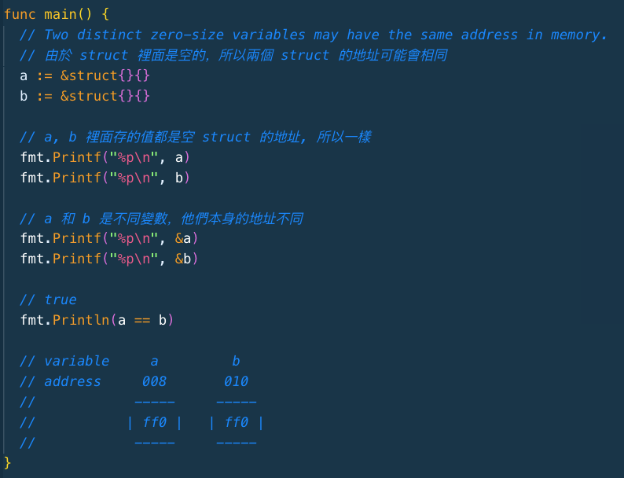
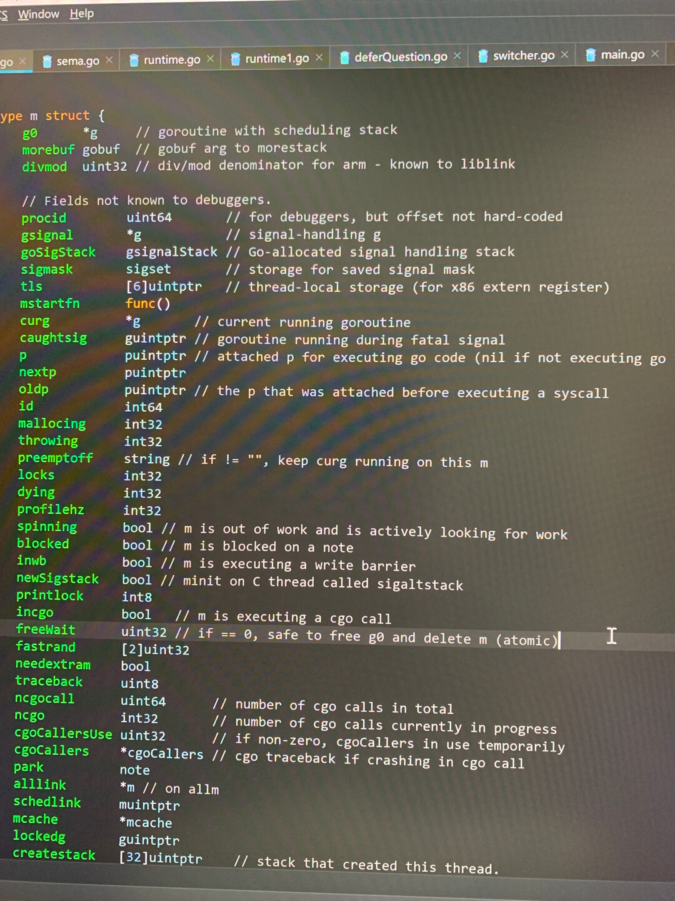

# 一周汇总  2019-04-21

## 每日一学

### 问题一：

关于可寻址（可取地址）

1. 直接值（临时值）不能取地址；
    如：&true、&"abc"、&math.Int() 等都是非法；

2. 字符串字节元素不能取地址；
    如：

  ```go
  s: = "Hello World"
  _ = &(s[5])
  ```

3. map 元素不能取地址；
    如：

  ```go
  m := map[int]int{99:1}
  _ = &(m[99])
  ```

4. 编译器只会自动对变量取地址，而不会自动对直接值取地址；
    如：

  ```go
  type T struct{}
  func (t *T) f() {}
  func main() {
      t := T{}
      (&t).f() // ok ，和下一句等价 
      t.f()  // ok ，将自动取地址
  
      (&T{}).f() // ok
      // T{}.f() // error
                // 不会自动取地址
  }
  
  ```

那么为什么经常见到 `&T{}` 这种写法？`&T{}` 是为了编程方便，添加的一个语法糖 ，是下面形式的缩写，而不是临时值不能取地址的一个例外。

```go
temp := T{}
&temp
```


**讨论结果：**

1.  new(T)相当于取T的地址，等价于&T{}


### 问题二：

`_` 标识符的常用场景：

1. 在多重赋值场景中，忽略某些值，常见于 `if`、`for` 等语句中，如：`if _, err := os.Stat(path); os.IsNotExist(err)`；
2. 没有使用的 import 或变量，常用于调试；
3. import 包只使用包的副作用，常见的是导入 mysql 等数据驱动；
4. 接口类型检查，常见的有：类型断言 -> `if _, ok := val.(json.Marshaler); ok`；保证实现某个接口 -> `var _ json.Marshaler = (*RawMessage)(nil)`；


**讨论结果：**

- 這樣也能夠判斷有沒有實現接口：`var _ json.Marshaler = &RawMessage{}`。這兩種寫法有什麼差異嗎，基本上看到的都是第一種寫法。
  - 你这种写法，会分配内存，而上面的，不需要
  - 剛剛自己測了一下。原來是把 nil 轉成 pointer to a struct.


### 问题三：

Go 语言函数的各种用法汇总
因为内容较多，排版需要，发布在了 Go 中文网，付费用户登录可见。
[付费用户「每日一学」2019-04-17：Go 语言函数的各种用法汇总  - Go语言中文网 - G...](https://studygolang.com/topics/8833)


### 问题四：

关于 “逗号 ok/error”  模式

Go 支持多返回值，因此经常见到 `, ok` 或 `, error` 这种模式。在一个需要赋值的 if 条件语句中，使用这种模式去检测第二个参数值会让代码显得优雅简洁。这种模式在  Go 语言编码规范中非常重要。我们梳理下都有哪些情况下会使用该模式。

1. 在函数返回时检测错误；
2. 检测 map 中是否存在一个键值；
3. 检测一个接口类型变量 varI 是否包含了类型 T，即类型断言；
4. 检测一个通道 ch 是否关闭；`if input, closed := <-ch; closed { ... }`


### 问题五：

关于类型
Go 中的类型可以分为命名类型（named type） 和未命名类型（unnamed type）。命名类型包括 bool、int、string 等，而 array、slice、map 等和 具体元素类型、长度等有关，属于未命名类型。

- 具有 相同声明的未命名类型 被视为同一类型。
  - 具有相同基类型的指针。
  - 具有相同元素类型和⻓度的 array。
  - 具有相同元素类型的 slice。
  - 具有相同键值类型的 map。
  - 具有相同元素类型和传送方向的 channel。
  - 具有相同字段序列 (字段名、类型、标签、顺序) 的匿名 struct。 
  - 签名相同 (参数和返回值，不包括参数名称) 的 function。
  - ⽅法集相同 (方法名、方法签名相同，和次序⽆无关) 的 interface。

巩固一下：

1. `type MyMap map[string]string`
   这是命名类型还是未命名类型？

2. 以下代码是否有问题，哪里有问题，为什么？

  ```go
  package main
  import (
  	"fmt"
  )
  func main() {
      type MyMap1 map[string]string
      type MyMap2 map[string]string
      var myMap = map[string]string{"name": "polaris"}
      var myMap1 MyMap1 = myMap
      var myMap2 MyMap2 = myMap1
      fmt.Println(myMap2)
  }
  ```

  

**讨论结果：**

1. `type MyMap map[string]string`  规定了元素的类型必须是string，不能再更改，所以就属于命名类型；
2. 既然属于命名类型，那么第二题中的 `MyMap1  MyMap2`就是两个不同类型，不能够相互赋值；
3. 命名类型 和 非命名类型 相互赋值，只要基础类型一样就可以。


### 问题六：

今日有球友问这里 [CodeReviewComments · golang/go Wiki · GitHub](https://github.com/golang/go/wiki/CodeReviewComments#interfaces) 关于接口的建议，说不明白什么意思，我总结的理解如下：
1. 在设计接口时，接口的定义应该放在使用该接口的包中，而不是实现了该接口的包中；
2. 实现包应该返回具体的类型（通常是指针或结构体值），这样，实现包能够方便地增加新方法；
比如，os 包中的 File 类型实现了 io 包中的 io.Writer，Open 等方法返回的是具体的 File 指针，而不是 Writer 等接口
3. 应该有真实的某接口使用场景，才定义接口，在没有具体的使用场景情况下，是否有必要定义接口很难判断，更难决定接口中应该包含什么方法。这里的意思是，一般来说，先定义具体的类型，在此基础上才能够更好地抽象出接口，尤其是没有具体的接口使用场景下，别凭空想象出一个接口。


## 面试题

#### **问题一：**

关于 Go 中的函数参数按值传递的问题。
如下代码：

```go
func main() {
	arr := []int{2, 3, 4}
	fmt.Printf("函数前：%p\n", arr)
	printSlice(arr)
}
func printSlice(arr []int) {
	fmt.Printf("函数中：%p\n", arr)
}
```

两次输出一样吗？为什么？


**讨论结果：**

1. 两次输出一样，输出的都是底层数组首元素的地址；

2. 因为切片在go语言底层实现中是一个结构体，函数参数传递的时候将该结构体拷贝，该结构体的地址改变了，但是结构体存储的底层数组的地址没有改变，代码中的体现就是这样：

   ```go
   //	打印底层数组首元素的地址，传参后结果一样
   fmt.Printf("%p", &arr[0])
   fmt.Printf("%p", arr)
   //	打印切片（结构体）的地址，传参后因为拷贝了，所以结果不一样
   fmt.Printf("%p", &arr)
   ```

   


#### 问题二：

下面代码（判断 a == b ）的部分输出的是什么？为什么？

```go
func main() {
	a := &struct{}{}
	b := &struct{}{}
	fmt.Printf("%p\n", a)
	fmt.Printf("%p\n", b)

	fmt.Println(a == b)
}
```


**讨论结果：**

1. True
2. a, b 變數本身的地址不一樣，但是裡面存的地址一樣。
   

3. 我看完這篇就通了，強力推薦 <https://blog.golang.org/slices>
   - 提示下，本题有一个知识点：逃逸分析


## 聊聊基础

### 问题一：

不查阅任何资料，你能说出 HTTP 协议的哪些知识点？

**讨论结果：**

- 200 302  404 500  502 
  包头常用的几个字段，content type host xforword 等
  Gey post put delete 
  Basic 认证
  Restful
  Https =http＋认证＋检验＋TSL加密
  Websocket 
  Web框架beego gin 
  Nigix apache
- http header
  http status code
  http / https
  CORS
  http cookie
- 请求头、响应头、cookie，cookie可以设置时间有效期，也可以是会话，浏览器关闭就没有了。由于http的协议特性是无状态的，所以有了 session机制，session基于cookie，可以让服务器识别 上一个请求和下一个请求 是同一个客户端发起的。常用语登录，身份识别。
  请求状态码 2xx 3xx 4xx 5xx ，5xx是服务器端出问题，4xx是客户端出问题。
  请求方式 get、post、put、delete、patch、head，可以做 reseful
  请求缓存304、http是七层协议，基于tcp，tcp是四层协议，
  默认端口http是80 https是443, http是请求应答式，文本协议，客户端能发起请求到服务器端，服务器端要主要发给客户端，可以通过websocket、sse实现。websocket 可以通过协议升级将http升级为websocket、常见的web服务器有iis、nginx、apache。
  感觉http的东西挺多的，学的乱七八糟，没有一个完整的知识体系架构。推荐学习的书籍是 http权威指南 还有一本图解http。


## 爬虫系列

### 问题一：

[爬虫准备知识 Colly 学习之二：Colly 的设计  - Go语言中文网 - Golang中文社...](https://studygolang.com/topics/8872)  最后留了作业，建议大家动手实现一下。


## 作业点评

### case01：

对发邮件作业的 Review 点评，建议大家可以看看他的实现。[GitHub - LIYINGZHEN/go-smtp: Go SMTP Example](https://github.com/LIYINGZHEN/go-smtp)
设计的挺好的，建议试着写文章讲解下 smtp 发邮件，包括你的设计，能让别人明白你的设计，对你会有大的提升。
值得称赞的一些点：

1. 很正式，不只是简单的当做作业实现了发邮件功能；
2. 尝试使用了开源比较流行的工程结构，体现出来很认真学习；
3. 用心进行了设计；
4. 对环境变量的支持；

有几点建议或问题:

1. 考虑将该包完善，作为日常发邮件使用甚至供别人使用；

2. Smtper 这个接口，如果只是内部使用，接口的意义何在？如果不是，里面的 new 方法为什么不导出？笔误？

3. 自定义的包名 smpt；是故意的还是笔误？

4. module 的方式不对；对于放在 github 的包，module 应该类似：
   `go init github.com/LIYINGZHEN/gosmtp`，最后的 gosmtp 和 github repo 应该一致，避免不必要的麻烦；这样，cmd 中的使用应该导入完整路径；

5. config 包，应该只是配置发件人邮箱相关信息，收件人、邮件内容等，不应该放在 config 中；

6. 对使用者暴露了太多内容；使用不太方便，比如简单的方式：

   ```go
   mail := NewMail()
   mail.Sender = xxx（包括发送邮件的一些配置）
   mail.To = xxx
   mail.Subject = xxx
   mail.Body = xxx
   gosmtp.Send(mail)
   ```

7. 应该同时支持非 TLS 的发送，即 25 端口；

8. 构建邮件内容时，字符串拼接较多，可以考虑使用 bytes.Buffer 优化。


## 同学问的问题

### 问题一：

有个场景，对方抛来一个ip和一个路径，要把这个ip写入到这个路径下，如何在并发下使用channel把ip写入到文件去，使用buffchannel效果会更好吗

**球主回答：**

- 嗯，buffer chan 性能会更好，但具体长度多少合适，需要实际情况丁


### 问题二：

请问，从字符串里查找IP，除了正则表达式匹配，还有别的方法吗。

**球主回答：**

- 进行模式匹配，正则大概是最好的方式吧！


### 问题三：

系统线程为什么可以被delete？ 看这行注释： `// if == 0，safe to free g0 and delete m（atomic）` GPM模型中m是系统线程，为何是被delete呢？或许是 kthread_stop？问题来自 groutine 源代码：



**球主回答：**

- 我的理解，应该只是删除 m 结构体，而不是实际的系统线程。我会进一步查阅源码和资料，争取正在解决困惑，也欢迎大家一起探讨。
  - 应该不是的，能被block或者exec，不会是一个结构体的。
  - 我说的结构体，是释放 m 对应的数据结构内存


## 今日作业

### 题目一：

使用 Go 语言通过 SMTP 协议实现发送邮件功能！交作业可以贴你的 github 代码链接地址。这两天希望大家可以抽空实现下。


## 今日链接

- [Golang 之 Context 的迷思](https://mp.weixin.qq.com/s/MV7aPBgU0WayK-is78AFdg)
- [slice什么时候决定是否要扩张？](https://mp.weixin.qq.com/s/deoYgTNWGPvXQeP2SpVTpg)
- [Go 中子测试和子基准测试的使用](https://mp.weixin.qq.com/s/xPfeCdepIcVEP824UoLlZQ)
- Go语言中对于字符串的操作会很频繁，在此分享两篇文章，介绍有关字符串函数操作的。
  [Go语言中字符串操作常用函数介绍  - Go语言中文网 - Golang中文社区](https://studygolang.com/articles/19914)
  [Go语言中有关字符串替换函数的介绍  - Go语言中文网 - Golang中文社区](https://studygolang.com/articles/19915)

