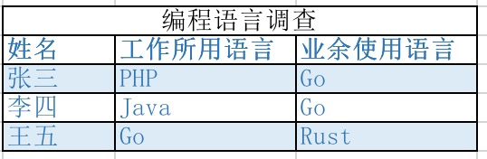

# 一周汇总 2019-00-00

## 每日一学

### 问题01：

[付费用户「每日一学」2019-04-29：关于注释的一些约定  - Go语言中文网 - Golang...](https://studygolang.com/topics/8972)


### 问题02：

Structs, Arrays, Slices 和 Maps 等复合数据类型的比较  

- 如果结构体中的各个元素都可以使用等号来比较的话，那就可以使用相号 `==` 来比较结构体变量；结构体中的元素无法比较，用 `==` 比较结构体会导致编译错误； 
- 对于无法直接通过 `==` 进行比较的，可以通过 reflect.DeepEqual 进行比较；
- 所以，slice、map 等都可以通过该方法进行比较；
- reflect.DeepEqual 不会认为空的 slice 与 `nil` 的 slice 相等；这和 bytes.Equal() 的行为相反；  
- 关于比较，除了这里提到的 `==`、reflect.DeepEqual 和 bytes.Equal()，你还知道哪些呢？


#### **讨论结果：**

1. `subtle.ConstantTimeCompare()` 比較 secrets，避免時序攻擊


### 问题03：

关于字符串或 []byte 的比较问题
今日接着昨天的比较话题，看看还有哪些比较的方法，主要针对字符串或 []byte ：

- bytes 包中的 Compare、Equal、EqualFold，这三个函数都认为 空的 slice 与 `nil` 的 slice 相等；
Equal 和 EqualFold 的区别在于 EqualFold 忽略大小写；
- strings 包中也有 Compare 和 EqualFold，但没有 Equal；
- 果你的 byte slice 中包含需要验证用户数据的隐私信息（比如，加密哈希、tokens等），不要使用 reflect.DeepEqual()、bytes.Equal()，或者 bytes.Compare()，因为这些函数将会让你的应用易于被时序攻击。为了避免时序攻击，使用 `crypto/subtle` 包中的函数（即，subtle.ConstantTimeCompare()）；

问题：为什么 strings 包中没有 Equal 函数？欢迎讨论，每日一学，我们明天见~


## 同学问的问题

### 问题01：

@刘震 关于你在群里提到，ftp 下载多个文件的问题，我早上起来写了下，供你参考

[The Go Playground](https://play.studygolang.com/p/Y2tihIV_Am9)
这个链接是无法直接运行的哈，因为依赖 ftp 包，将代码到本地运行吧（记得下载依赖）


### 问题02：

 最近有个项目，想用go来作后台开发实现微信公众号微商城，小程序，app的统一后台开发，能不能分析一下前后台所用的最佳的技术栈

#### **解决思路：**

1. 球主回答：
   - 首先，一定前后端分离，这样基本上一套后端代码服务所有前端；
   - 后台：既然决定是用 Go 了，那主要分析下 Go 后台开发相关的。这里面最关键的一点，如果涉及到支付，一定要先调研微信有无 Go SDK，如果没有，自己能否实现，这个是关键，否则会阻碍进展；
   - Go 框架方面，推荐轻量级的 Gin 或 Echo；
   - 其他的，数据库方面，MySQL innodb 即可；
   - 前端：小公司、小团队，可以考虑下 vue 这种，可以同时解决公众号、APP（app原生只是一个空壳）；或者尝试 flutter。借用一句话，即使项目不成功，能收获新技术，对技术人员来说，也是成功的。
2. 微信sdk好像有，之前看过一点；
3. 微信支付宝GitHub有封装，自己开发有些阻碍是时间问题，公司的话要慎重多角度考虑比如go开发人员配备等


### 问题03：

星主，请教一个问题。
爬虫项目目录结构对于logic有点不太理解。比如我有一个index路由展示首页内容，需要调用两个微服务方法、操作一次mysql、操作一次redis、处理返回数据。这时，controller里面应该怎么处理了？是在controller里面调用5个logic层里面的方法（两个微服务处理方法、一个mysql处理方法、一个redis处理方法、一个返回数据处理方法）:

```go
logic.DefaultJob.Func1()
logic.DefaultJob.Func2()
logic.DefaultJob.Func3()
logic.DefaultJob.Func4()
logic.DefaultJob.Func5()
```

还是controller直接调用1个logic层里面的方法:
logic.DefaultJob.Func1() ,  Func1() 里面调用不同方法。
或者是其他方案了，有点疑惑。感谢老大指正

#### 讨论结果：

- controller 应该尽可能轻。所以，在 logic 处理。因为我这里主要在讲单体架构。微服务的话，依赖其他服务可能需要做一些封装
  - 我们现在就是微服务架构，但是业务逻辑全在C层，感觉太臃肿了。不知道该怎么封装。
  - 可以考虑引入 logic 层。


## 爬虫系列

- [爬虫系列4：系统设计（二）  - Go语言中文网 - Golang中文社区](https://studygolang.com/topics/8988)
- [爬虫系列5：系统设计（三）  - Go语言中文网 - Golang中文社区](https://studygolang.com/topics/9001)


## 资源分享

- 昨晚直播，网络不太好，将就下！主要听听音频即可，没有啥要看的。链接:<https://pan.baidu.com/s/117Ea0cf5Klb-ZMxunz3-Ow>  密码: xeuf 


## 每周作业

### 作业01：

这次的作业要求使用标准库 net/http 包实现一个简单的 web 应用，只需要一个首页，输入如图的表格，这里的关键是如何做到隔行颜色不一样，请使用 Go 模板库。


#### 讨论：

1. 您的意思是用Go做一个这样的表格出来，以网页的形式展现吗？
   - 嗯
2. 页面显示，肯定 html，但得服务端渲染


### 交作业

1. 我发表了一篇文章：[五一作业](https://articles.zsxq.com/id_draojkmz80wm.html)
2. 學到了如何使用模板、模板函數、分割模板。
   [GitHub - LIYINGZHEN/gotemplate: Go Template Demo (...](https://github.com/LIYINGZHEN/gotemplate)
   **点评：** 不得不说， Max 是咱们星球最认真的一位。从两次作业来看，每一次都是当做一个项目来做。大家可以看看。他还提供了怎么运行，总结了学习的知识点。很棒很棒。
3. 交作业！！
   [homework/template/main at master · mrtwenty/homewo...](https://github.com/mrtwenty/homework/tree/master/template/main)
   **点评：**有一点提醒：定义的 data 不是必要的。这个无关紧要，只要你知道，不定义 data，直接传递 list 给 Execute 也行。你知道自己在干什么就行。


### 作业总结

关于 51 期间作业的总结。这次作业整体上，大家比上次要好。加油！

这次作业主要想让大家掌握以下知识点：
1. 学会通过 net/http 开启一个 http 服务；
2. 学习 html/template 包的基本使用；
3. 学习自定义模板函数，扩展模板的功能；
4. 注意 @Hy、per 提到的问题：需要从文件获取模板的时候，New(name)的name必须和文件名一致
5. 进阶学习：学习类似 @Max  [GitHub - LIYINGZHEN/gotemplate: Go Template Demo (...](https://github.com/LIYINGZHEN/gotemplate)  中，定义 layout，抽取不同部分定义 block，做到共用和变化。


## 每周链接

- [GCTT | 宏观看 Go 语言中的 Map 内部](https://mp.weixin.qq.com/s/j7_D0vj7ZpYgM5NOLkh35g)
- [GCTT 出品 | 浅析 Go 语言的数字常量](https://mp.weixin.qq.com/s/IWzAWFMde_oa13YVepPnPw)


