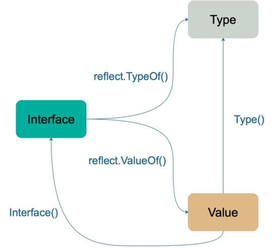
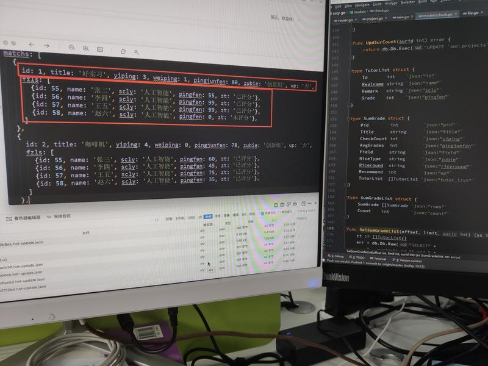
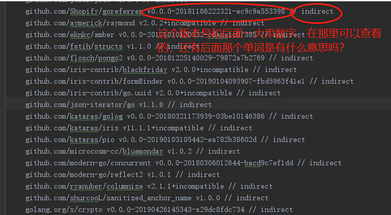
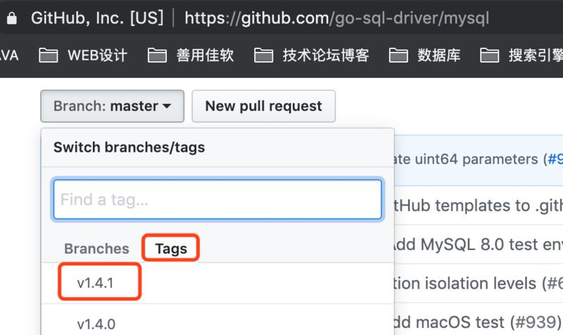

# 一周汇总 2019-05-12

## 每日一学

### 问题01：

 Go 中的类型知识点

- named type（有名类型）和 unnamed type（无名类型）；
  - 这些内置类型都是 named type：bool string int8/uint8(byte)/int16/uint16/ int32(rune)/uint32/int64/uint64/int/uint float32/float64/complex64/complex128
  - unnamed type 有：结构体 `struct {...}`、指针 `*T`、映射 `map[T1]T2`、函数 `func(Ta, Tb, ...) (T1, T2, ...)`、接口 `interface{...}`、数组 `[N]T`、切片 `[]T`、通道 `chan T`；
  - 两者类型中有一个无名类型就可以隐式转换；否则必须显示转换；
- 底层类型（underlying type）：
  - 所有内置类型的底层类型均为其本身；
  - 一个类型的底层类型，最终追溯到 unnamed type 或 内置简单类型 为止；
  - 两个值类型确定并且两者的底层类型相同，才可以相互转换；
- 直接值（direct value）包括：无名常量、有名常量、临时值和中间计算结果等；直接值是不可寻址的；一个值要么是直接值要么是变量，变量是可寻址的；
- untyped value（无类型值）和 typed value（有类型值）
  - 字面值常量为无类型值；
  - 定义常量不指定类型时，为无类型值，如：const i = 2；
  - 无类型值可以隐式转换为具有相同的底层类型变量；


### 问题02：

反射的三大定律
- 反射是一种检测存储在 interface 中的类型和值的机制。这可以通过 reflect.TypeOf 函数和 reflect.ValueOf 函数得到；（Reflection goes from interface value to reflection object.）
- 将 reflect.ValueOf 的返回值通过 Interface() 函数反向转变成 interface 变量；（Reflection goes from reflection object to interface value.）
- 如果需要修改一个反射对象，那么它必须是可设值（settable）的。反射对象可设置的本质是它存储了原变量本身，这样对反射对象的操作，就会反映到原变量本身；反之，如果反射对象不能代表原变量，那么操作了反射变量，不会对原变量产生任何影响，这会给使用者带来疑惑，所以这种情况在语言层面是不被允许的。记住一句：如果想要操作原变量，反射对象 Value 必须要 hold 住原变量的地址才行。


### 问题03：


### 


#### **讨论结果：**

1. 


### 问题04：


### 


#### **讨论结果：**

1. 


## 聊聊基础

### 路径问题：

记得星球创建的时候，我就发过一个关于绝对路径和相对路径的。绝对路径，想必很多人都没啥问题，但相对路径很多人却迷迷糊糊，而且，程序中，很多时候是不应该使用绝对路径的，那样会有移植问题。虽然给一个路径，知道是绝对路径还是相对路径，但放到程序中却经常出现 文件找不到 的错误，究其原因，还是没弄明白相对路径到底相对什么！
无论是语言，还是操作系统层面，都能得到一个进程的当前工作目录 cwd ，在程序中，相对路径就是相对当前工作目录。
在终端，相对路径其实也是相对当前工作目录，因为 shell 也是一个进程，提供很好的交互界面而已，你当前所在的目录就是 shell 进程的工作目录。
那么，在 linux 如何查看一个进程的工作目录呢？Go 语言中又是如何获得当前工作目录的？你能写个 Go 程序，验证下 Linux 下获得的和 Go 中获取的是一致的吗？

#### 讨论：

- linux我一般用pwd，go用os.Getwd()

  ```go
  package main
  
  import (
      "os"
      "os/exec"
      "fmt"
      "log"
  )
  
  func main() {
      cmd := exec.Command("pwd")
      output, err := cmd.Output()
      if err != nil { log.Fatal(err) }
  
      pwd := string(output)
      wd, err := os.Getwd()
      if err != nil { log.Fatal(err) }
  
      fmt.Println(pwd)   // 输出/home/heyi/go\n
      fmt.Println(wd)     // 输出/home/heyi/go
  }
  ```

  -  Linux 下是看某个进程的 工作目录，不是看当前所在目录
  - 用pwdx 进程PID么，或者`ll /proc/进程PID/cwd`，看看软链接指向哪个目录


## 知识点学习

### 知识点干货：

1. 


## 常见坑

### 问题01：


### 


#### **讨论结果：**

1. 
   


### 问题02：


### 


#### **讨论结果：**

1. 


## 面试题

### 问题01：

**关于常量**
以下代码是否有问题？为什么？

```go
package main
import (
	"fmt"
)
func main() {
    const a = 2
    const b int32 = 3
    var c int = a
    var d int = b
    fmt.Println(c, d)
}
```

如果加一个：var e int64 = a 呢，这个是否可以？


#### **讨论结果：**

1. a 属于无类型常量(𝙪𝙣𝙩𝙮𝙥𝙚𝙙 𝙘𝙤𝙣𝙨𝙩𝙖𝙣𝙩𝙨)，可以賦值給任何一個整數類型 (integer types)，例如：

   𝐯𝐚𝐫 𝐟 𝐟𝐥𝐨𝐚𝐭𝟑𝟐 = 𝐚
   𝐯𝐚𝐫 𝐠 𝐜𝐨𝐦𝐩𝐥𝐞𝐱𝟔𝟒 = 𝐚
   𝐯𝐚𝐫 𝐡 𝐮𝐢𝐧𝐭𝐩𝐭𝐫 = 𝐚
   𝐯𝐚𝐫 𝐢 𝐛𝐲𝐭𝐞 = 𝐚

2. b 


### 问题02：


### 


#### **讨论结果：**

1. 

   

### **问题03：**


### 


#### **讨论结果：**

1. 


### 问题04：


### 


#### **讨论结果：**

1. 
   ​	


### 问题05：


### 


#### **讨论结果：**

1. 


### 问题06：


### 


#### **讨论结果：**

1. 


## 资源分享

- interface、reflect.Type 和 reflect.Value 三者的关系图。
  
- 


## 作业

### 题目01：

有一个需求：有一个文件，如 <https://raw.githubusercontent.com/avelino/awesome-go/master/README.md> ，现在想根据里面的 github 地址，获得该项目的 star 数和最后更新时间，并写入对应行的最后。要求使用 Go 语言实现。

#### 讨论：

-  github有速率限制，报错：You have triggered an abuse detection mechanism。怎么绕过啊，难道我也要控制访问频次？
  - 不能太频繁，看它文档要求吧


## 同学问的问题

### 问题01：

module错误：can not find module providing package  包路径。


#### **解决思路：**

1. 针对这样的问题，一般是由于 GOPROXY 不稳定导致的，建议按如下方式多做尝试：
   - export GOPROXY=    即 GOPROXY 留空；然后执行 go get
   - export GOPROXY=[https://athens.azurefd.net](https://athens.azurefd.net/)  ；然后执行 go get
   - export GOPROXY=[https://goproxy.io](https://goproxy.io/) ；然后执行 go get

2. GOPROXY变量用来控制下载源码的地址。


### 问题02：

请教一个问题，使用 gorm 查询到两个数据集 scan 到两个结构体数组，这两个结构体数组如何根据对应关系嵌套，遍历的话好想没有办法指定索引。左边是前端需要的 json 格式，右边是我定义的结构体。



#### 球主回答：

不应该有个关联表，能够关联两者的关系嘛？
不太清楚具体业务，但我想到的两种思路：
1、沿用你的方式，一个结构体（表中）应该能够关联上另外一个结构体（表）；
2、直接使用 gorm 的连表处理；

- 数据是可以查出来的，但是我不太会处理。暂时想到的两种方法一种是两种数据集合并，但是这里有技术盲点，另一种是一条 sql 查出来后转成这种json tree 格式。
  - 如果索引 OK，暂时也不会服务拆分，连表挺好的


### 问题03：

怎样用git查看这些信息，而且怎样选择版本？



#### 球主回答：

版本号的问题，可以看看 go module 的官方博客：[Go 语言的 Modules 系统介绍  - Go语言中文网 - Golang中文社区](https://studygolang.com/articles/14389) 

版本号见图中，也就是打的 tag。

对于没有打 tag，没有使用 go mod 的包，版本号就会是 v0.0.0，而后面一长串对应 git 的一次提交，可以通过 git log 这一长串  来看具体的提交

indirect 表示间接引用，也就是说，这个包不是你的代码直接引用的，而是你引用的包引用的。




### 问题04：

 公司有个restful api项目准备用go重构，jwt，orm，WeChat api，cache，web框架，老师有什么好介绍吗？


#### 球主回答：

jwt：[GitHub - dgrijalva/jwt-go: Golang implementation of JSON Web Tokens (JWT)](https://github.com/dgrijalva/jwt-go)
orm：gorm 或 xorm
wechat api 没啥好说的吧，官方没 SDK 的话，自己封装；

**讨论：**

- 强烈推荐 gin 。用它做了 3 个项目了，体验不错。orm 用的是 gorm 但体验一般般，感觉可以尝试下 xormplus 。微信 sdk ，github 上有第三方封装好的可以直接用。
-  gin 確實不錯，不過在用的同時最好底層的原理要懂
- 大佬，有什么好jwt框架介绍？
  - 我也用群主給的那個 JWT。


### 问题05：

博主，module 和 vendor 有什么不同，怎么感觉作用差不多。

#### 球主回答：

嗯，vendor 更多是社区的解决方案，因为之前 Go 官方对依赖问题没处理，所以才有社区的方案。Module 是 Go 官方的方案，是将来标准。

## 每周链接

- [一个让业务开发效率提高10倍的golang库](https://mp.weixin.qq.com/s/U_8-IUBc5r5aevNK00YhIw)
- [Go 中文网发福利 | 免费领取 Go 语言学习视频](https://mp.weixin.qq.com/s/57X3tquM12ekCTncsBuS3Q)


