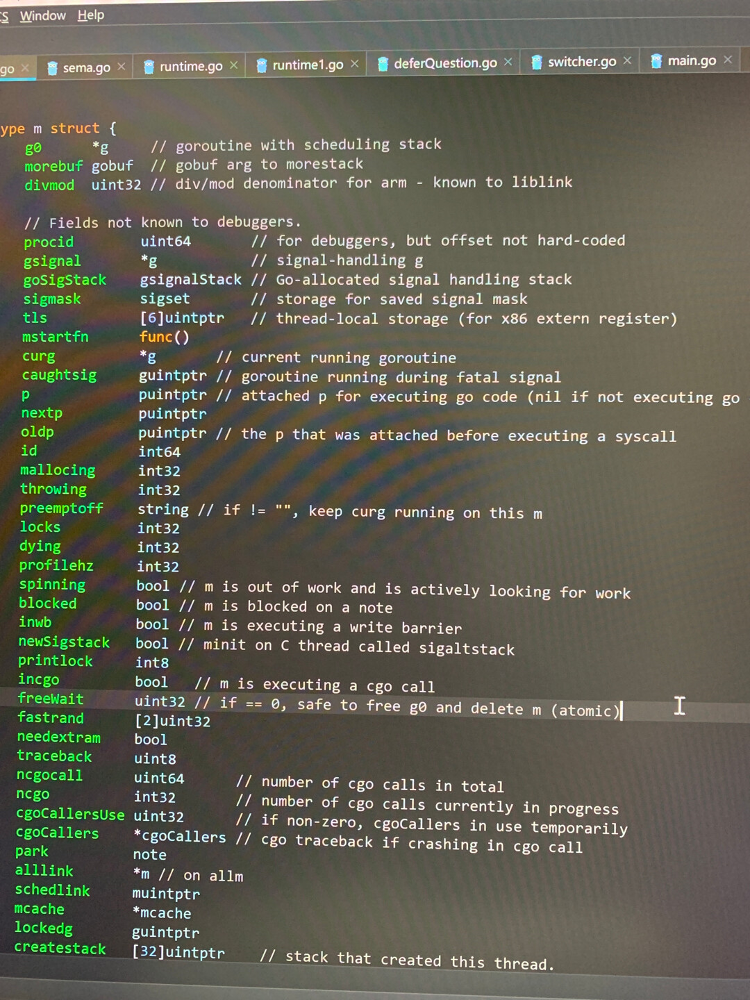

# 今日总结  2019-04-21

## 每日一学

### 问题一：

关于可寻址（可取地址）

1. 直接值（临时值）不能取地址；
  如：&true、&"abc"、&math.Int() 等都是非法；

2. 字符串字节元素不能取地址；
  如：

  ```go
  s: = "Hello World"
  _ = &(s[5])
  ```

3. map 元素不能取地址；
  如：

  ```go
  m := map[int]int{99:1}
  _ = &(m[99])
  ```

4. 编译器只会自动对变量取地址，而不会自动对直接值取地址；
  如：

  ```go
  type T struct{}
  func (t *T) f() {}
  func main() {
      t := T{}
      (&t).f() // ok ，和下一句等价 
      t.f()  // ok ，将自动取地址
  
      (&T{}).f() // ok
      // T{}.f() // error
                // 不会自动取地址
  }
  
  ```

那么为什么经常见到 `&T{}` 这种写法？`&T{}` 是为了编程方便，添加的一个语法糖 ，是下面形式的缩写，而不是临时值不能取地址的一个例外。

```go
temp := T{}
&temp
```


**讨论结果：**

1.  new(T)相当于取T的地址，等价于&T{}


### 问题二：

`_` 标识符的常用场景：

1. 在多重赋值场景中，忽略某些值，常见于 `if`、`for` 等语句中，如：`if _, err := os.Stat(path); os.IsNotExist(err)`；
2. 没有使用的 import 或变量，常用于调试；
3. import 包只使用包的副作用，常见的是导入 mysql 等数据驱动；
4. 接口类型检查，常见的有：类型断言 -> `if _, ok := val.(json.Marshaler); ok`；保证实现某个接口 -> `var _ json.Marshaler = (*RawMessage)(nil)`；


**讨论结果：**

- 這樣也能夠判斷有沒有實現接口：`var _ json.Marshaler = &RawMessage{}`。這兩種寫法有什麼差異嗎，基本上看到的都是第一種寫法。
  - 你这种写法，会分配内存，而上面的，不需要
  - 剛剛自己測了一下。原來是把 nil 轉成 pointer to a struct.


### 问题三：

Go 语言函数的各种用法汇总
因为内容较多，排版需要，发布在了 Go 中文网，付费用户登录可见。
[付费用户「每日一学」2019-04-17：Go 语言函数的各种用法汇总  - Go语言中文网 - G...](https://studygolang.com/topics/8833)


### 问题四：

关于 “逗号 ok/error”  模式

Go 支持多返回值，因此经常见到 `, ok` 或 `, error` 这种模式。在一个需要赋值的 if 条件语句中，使用这种模式去检测第二个参数值会让代码显得优雅简洁。这种模式在  Go 语言编码规范中非常重要。我们梳理下都有哪些情况下会使用该模式。

1. 在函数返回时检测错误；
2. 检测 map 中是否存在一个键值；
3. 检测一个接口类型变量 varI 是否包含了类型 T，即类型断言；
4. 检测一个通道 ch 是否关闭；`if input, closed := <-ch; closed { ... }`


## 知识点学习

1. 


## 常见坑

#### 问题一：


**讨论结果：**

1. 


## 面试题

#### **问题一：**

关于 Go 中的函数参数按值传递的问题。
如下代码：

```go
func main() {
	arr := []int{2, 3, 4}
	fmt.Printf("函数前：%p\n", arr)
	printSlice(arr)
}
func printSlice(arr []int) {
	fmt.Printf("函数中：%p\n", arr)
}
```

两次输出一样吗？为什么？


**讨论结果：**

1. 两次输出一样，输出的都是底层数组首元素的地址；

2. 因为切片在go语言底层实现中是一个结构体，函数参数传递的时候将该结构体拷贝，该结构体的地址改变了，但是结构体存储的底层数组的地址没有改变，代码中的体现就是这样：

   ```go
   //	打印底层数组首元素的地址，传参后结果一样
   fmt.Printf("%p", &arr[0])
   fmt.Printf("%p", arr)
   //	打印切片（结构体）的地址，传参后因为拷贝了，所以结果不一样
   fmt.Printf("%p", &arr)
   ```

   


#### 问题二：

下面代码（判断 a == b ）的部分输出的是什么？为什么？

```go
func main() {
	a := &struct{}{}
	b := &struct{}{}
	fmt.Printf("%p\n", a)
	fmt.Printf("%p\n", b)

	fmt.Println(a == b)
}
```


**讨论结果：**

1. True
2. a, b 變數本身的地址不一樣，但是裡面存的地址一樣。
   

3. 我看完這篇就通了，強力推薦 <https://blog.golang.org/slices>
   - 提示下，本题有一个知识点：逃逸分析


## 同学问的问题

### 问题一：

有个场景，对方抛来一个ip和一个路径，要把这个ip写入到这个路径下，如何在并发下使用channel把ip写入到文件去，使用buffchannel效果会更好吗

**球主回答：**

- 嗯，buffer chan 性能会更好，但具体长度多少合适，需要实际情况丁


### 问题二：

请问，从字符串里查找IP，除了正则表达式匹配，还有别的方法吗。

**球主回答：**

- 进行模式匹配，正则大概是最好的方式吧！


### 问题三：

系统线程为什么可以被delete？ 看这行注释： `// if == 0，safe to free g0 and delete m（atomic）` GPM模型中m是系统线程，为何是被delete呢？或许是 kthread_stop？问题来自 groutine 源代码：



**球主回答：**

- 我的理解，应该只是删除 m 结构体，而不是实际的系统线程。我会进一步查阅源码和资料，争取正在解决困惑，也欢迎大家一起探讨。
  - 应该不是的，能被block或者exec，不会是一个结构体的。
  - 我说的结构体，是释放 m 对应的数据结构内存


## 今日作业

### 题目一：

使用 Go 语言通过 SMTP 协议实现发送邮件功能！交作业可以贴你的 github 代码链接地址。这两天希望大家可以抽空实现下。


## 今日链接

- [Golang 之 Context 的迷思](https://mp.weixin.qq.com/s/MV7aPBgU0WayK-is78AFdg)
- [slice什么时候决定是否要扩张？](https://mp.weixin.qq.com/s/deoYgTNWGPvXQeP2SpVTpg)
- [Go 中子测试和子基准测试的使用](https://mp.weixin.qq.com/s/xPfeCdepIcVEP824UoLlZQ)
- 